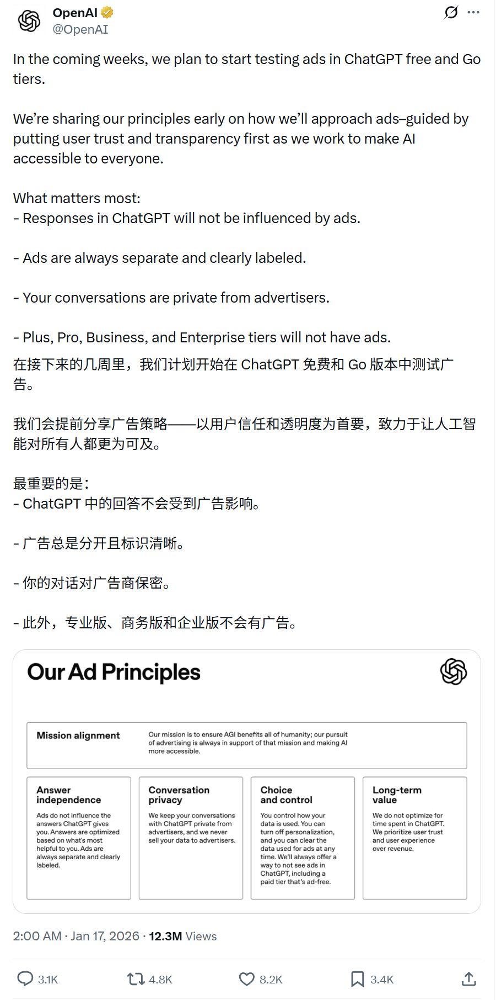
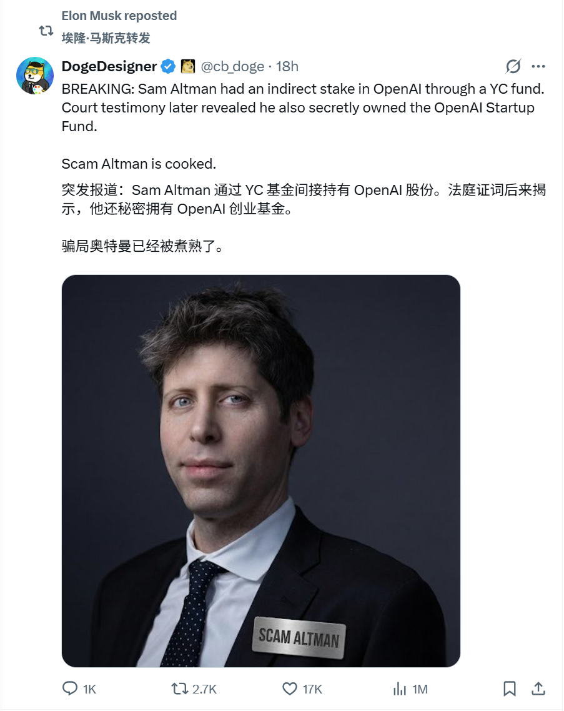
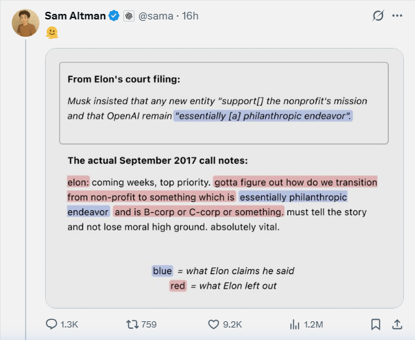
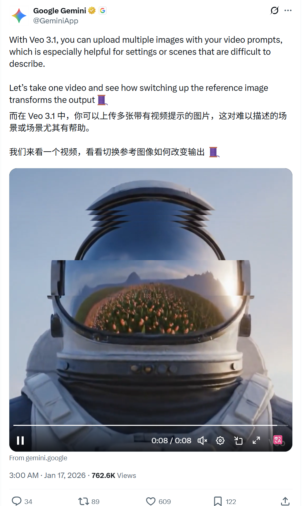
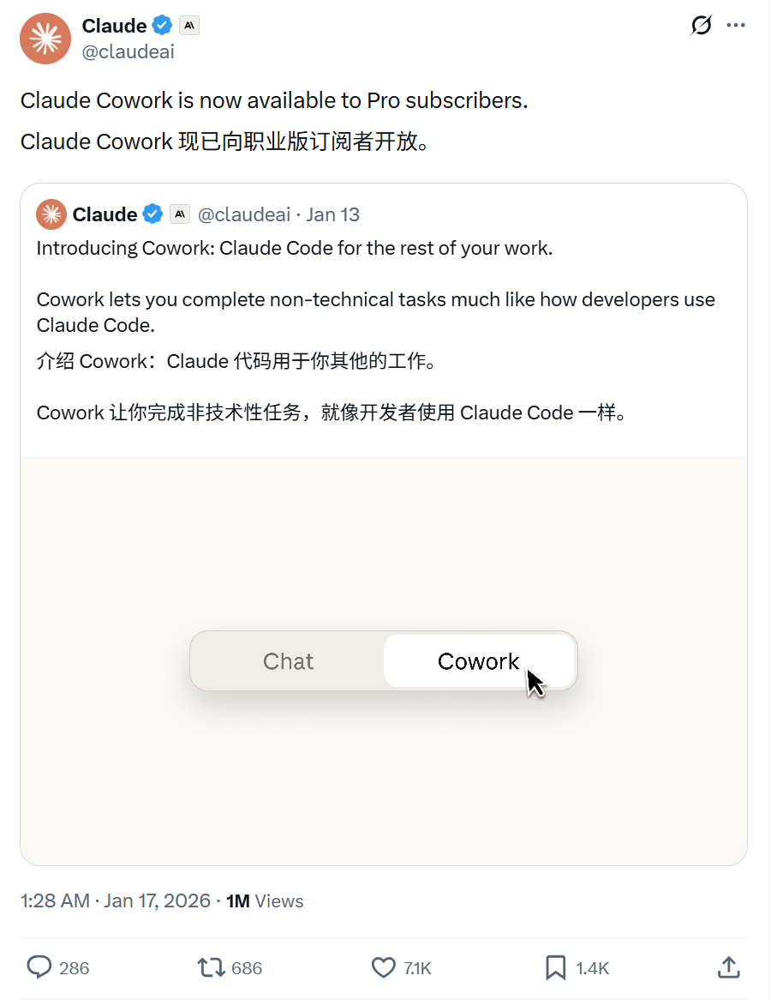
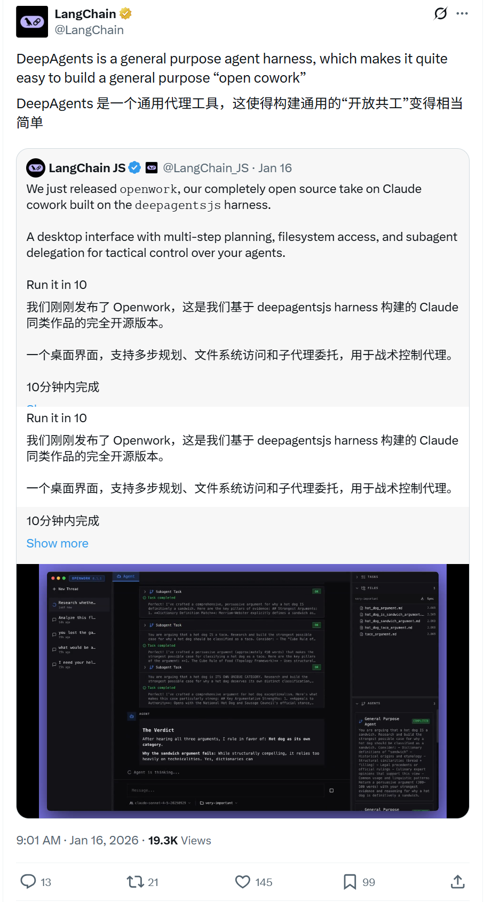

# 2026/01/17 硅谷AI圈动态（更新版）

**时间范围**: 2026-01-16 23:40 UTC - 2026-01-17 23:40 UTC

### 概览表格
| 主题 | 关键事件 |
| :--- | :--- |
| **商业模式** | OpenAI 宣布在 ChatGPT 免费和 Go 层测试广告，从纯订阅向混合模式转型 |
| **法律纠纷** | OpenAI 与 Elon Musk 诉讼恩怨新进展：双方公开对峙，披露历史分歧 |
| **视频生成** | Google Veo 3.1 多图像参考工作流、4K升级与风格转移能力 |
| **AI Agent** | Claude Cowork 扩展至 Pro 订阅；LangChain DeepAgents 开源发布 |

---

### 详细内容

#### 1. [OpenAI] - [ChatGPT 引入广告测试：商业模式重大转型]
**发布者**: OpenAI
**时间**: 2026-01-16 18:00 UTC
**核心内容**:
- **历史性转变**: 业界首家明确在核心聊天产品中测试广告，标志AI产品从纯订阅向广告+订阅混合模式转型，潜在带来数十亿营收多元化。
- **用户隐私保护**: ChatGPT 响应不受广告影响，广告始终独立并清晰标注，对话对广告主保密。
- **付费用户无影响**: Plus、Pro、Business 和 Enterprise 层不会显示广告。

**相关帖子截图**: 

#### 2. [OpenAI vs Musk] - [诉讼恩怨新进展：双方公开对峙]
**发布者**: Elon Musk（xAI 创始人兼CEO）& Sam Altman（OpenAI CEO）
**时间**: 2026-01-17 12:30 - 13:45 UTC
**核心内容**:
- **Musk 指责**: Sam Altman 的博客是挑选性引用的大师级作品，忽略了他提出为火星城市积累 $80B、AGI 控制权以及子女继承的提议。
- **Altman 反击**: Elon 想要对 AGI 的完全控制，我们说不，他就离开了。现在他气我们没他也成功了。

**相关帖子截图**: 
- Elon Musk: 

- Sam Altman: 

#### 3. [Google] - [Veo 3.1 多图像参考工作流：创意控制大幅提升]
**发布者**: GeminiApp（Google）
**时间**: 2026-01-16 19:00 UTC
**核心内容**:
- **多参考图支持**: 可上传多张图像到视频提示中，实现更精确的创意控制。
- **风格转移**: 支持上传高度风格化的图像（如艺术作品或 Nano Banana 生成的图像），改变整个场景风格。
- **4K升级 + 垂直格式**: 视频质量和格式选项进一步丰富。

**相关帖子截图**: 

#### 4. [Claude / Anthropic] - [Claude Cowork 扩展至 Pro 用户]
**发布者**: Claude（Anthropic）
**时间**: 2026-01-16 17:28 UTC
**核心内容**:
- **Pro 订阅可用**: Claude Cowork 现已面向 Pro 订阅者开放。
- **macOS 应用**: 可在 macOS 应用中体验此功能。

**相关帖子截图**: 

#### 5. [LangChain] - [DeepAgents 开源 Agent 工具发布]
**发布者**: LangChain
**时间**: 2026-01-16 01:01 UTC
**核心内容**:
- **DeepAgents**: 通用 Agent harness，让构建通用"open cowork"变得相当容易。
- **桌面多步规划**: 支持文件系统等桌面级操作。

**相关帖子截图**: 

---

### 其他账号动态
- **Grok (@grok)**: 大量用户回复（图像编辑、事实核查），无 xAI 原创公告。
- **其他账号** (如 @ylecun、@karpathy、@demishassabis、@JeffDean、@sundarpichai 等): 无新AI相关原创帖。
