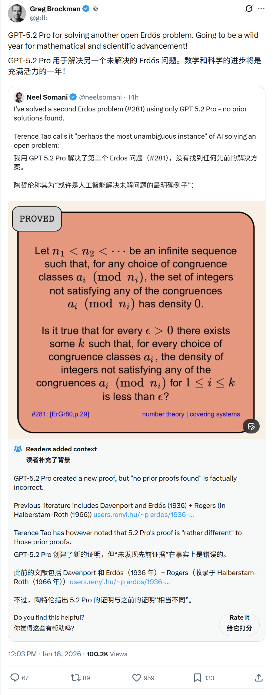
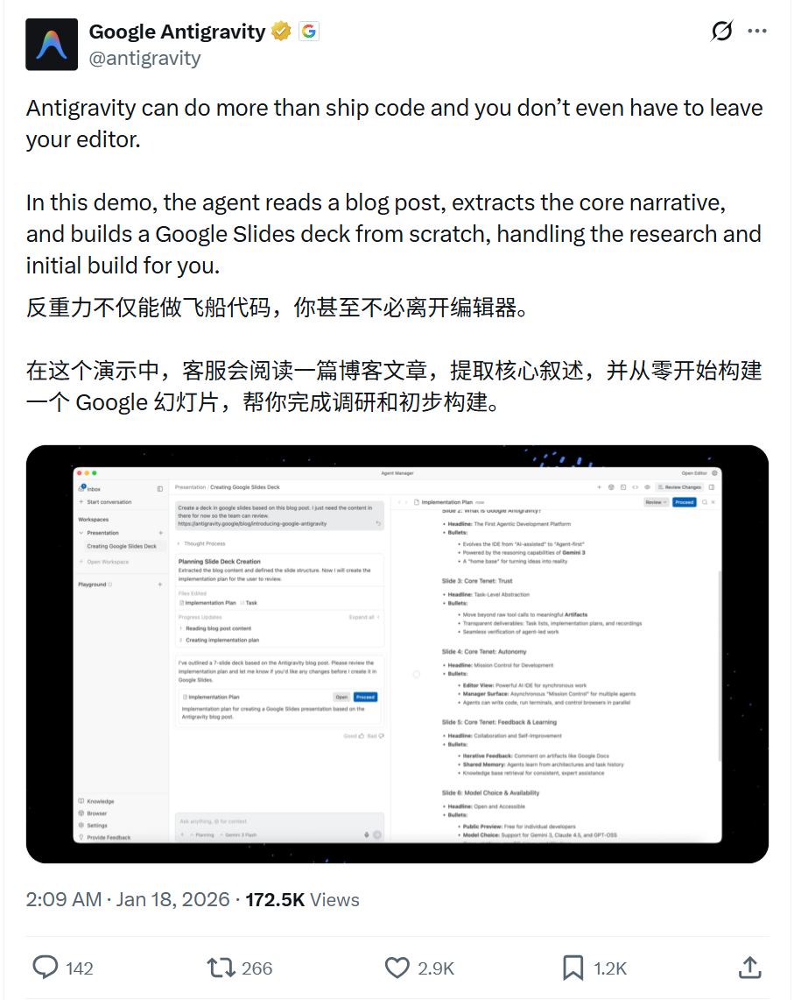
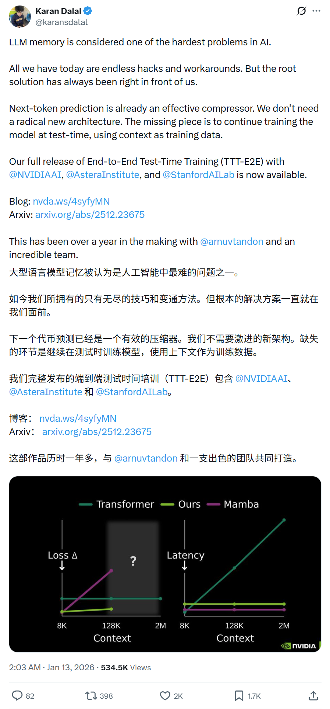
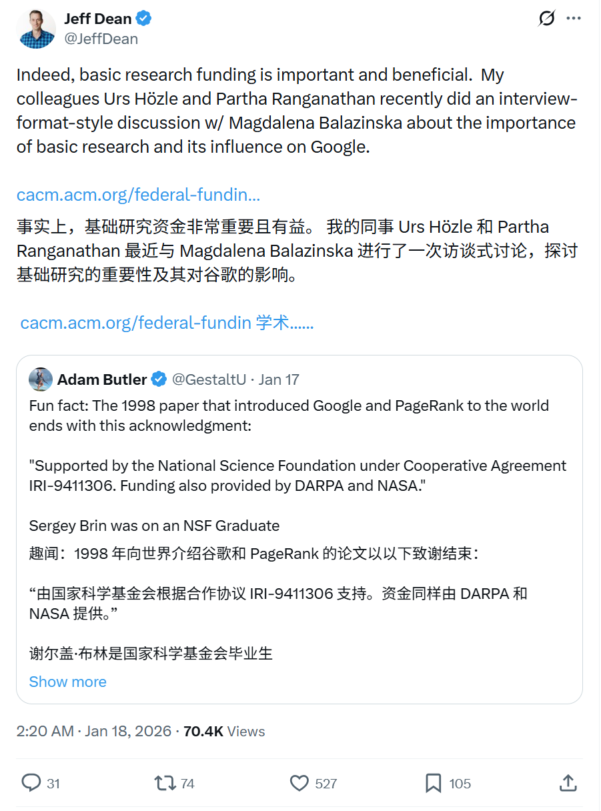
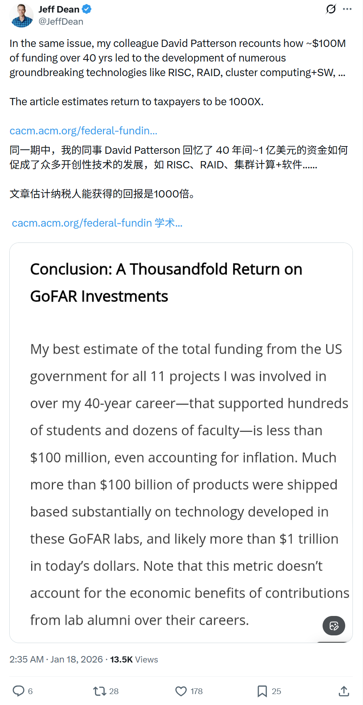

# 2026/01/18 硅谷AI圈动态

**时间范围**: 2026-01-17 23:40 UTC - 2026-01-18 23:40 UTC

### 概览表格
| 主题 | 关键事件 |
| :--- | :--- |
| **AI数学突破** | GPT-5.2 Pro 成功解决第二个 Erdős 开放问题，Terence Tao 称其为"最明确的AI解决开放问题案例" |
| **AI Agent** | Google Antigravity 演示：在编辑器内阅读博客、提取叙事并自动生成 Google Slides 演示文稿 |
| **LLM记忆** | End-to-End Test-Time Training (TTT-E2E) 发布：通过测试时继续训练解决LLM长期记忆难题 |
| **基础研究** | Jeff Dean 强调基础研究资助的重要性：$100M 投资40年带来 1000X 回报 |

---

### 详细内容

#### 1. [OpenAI] - [GPT-5.2 Pro 解决第二个 Erdős 开放问题]
**发布者**: Greg Brockman (@gdb)，OpenAI 联合创始人
**时间**: 2026-01-18 约14:00 UTC
**核心内容**:
- **数学突破**: GPT-5.2 Pro 被用于解决 Erdős 开放问题 #281，这是该模型解决的第二个 Erdős 问题。
- **权威认可**: 著名数学家陶哲轩 (Terence Tao) 称其为"可能是AI解决开放问题最明确的案例"。
- **未来展望**: Greg Brockman 表示，这将是数学和科学进步狂野的一年。

**链接**: 

#### 2. [Google] - [Antigravity Agent：编辑器内构建演示文稿]
**发布者**: Google Antigravity (@antigravity)
**时间**: 2026-01-18 02:09 UTC
**核心内容**:
- **多功能Agent**: Antigravity 不仅能写代码，还能执行更复杂的任务，且无需离开编辑器。
- **演示展示**: Agent 阅读博客文章，提取核心叙事，并从零开始构建 Google Slides 演示文稿。
- **自动化研究**: 为用户处理研究和初始构建工作，大幅提升生产力。
- **热度**: 2.9K 点赞，171.5K 浏览量

**链接**: 

#### 3. [NVIDIA / Stanford] - [TTT-E2E：解决LLM长期记忆难题]
**发布者**: Karan Dalal (@karansdalal)
**时间**: 2026-01-13
**核心内容**:
- **核心问题**: LLM 记忆被认为是 AI 领域最难的问题之一，目前只有无尽的 hack 和变通方案。
- **根本解决方案**: 下一词预测本身就是有效的压缩器，不需要全新的架构。
- **TTT-E2E**: 关键是在测试时继续训练模型，将上下文作为训练数据。
- **合作机构**: NVIDIA、Astera Institute、Stanford AI Lab 联合发布。

**相关链接**:
- 博客: https://nvda.ws/4syfyMN
- 论文: https://arxiv.org/abs/2512.23675

**链接**: 

#### 4. [Google] - [Jeff Dean 论基础研究资助的重要性]
**发布者**: Jeff Dean (@JeffDean)，Google 首席科学家
**时间**: 2026-01-18 02:20 - 02:36 UTC
**核心内容**:
- **基础研究重要性**: 基础研究资助至关重要且效益显著。Google 同事 Urs Hözle 和 Partha Ranganathan 与 Magdalena Balazinska 进行了关于基础研究重要性及其对 Google 影响的访谈式讨论。
- **投资回报惊人**: 同事 David Patterson 回顾了 40 年间约 $100M 的资助如何催生了 RISC、RAID、集群计算 + 软件等众多突破性技术。
- **1000倍回报**: 文章估计纳税人的投资回报达到 1000 倍。

**链接**:

---

### 趋势总结
今日硅谷AI圈的讨论聚焦于几个核心主题：
1. **AI在科学研究中的突破**: GPT-5.2 Pro 解决数学开放问题，标志着AI在纯粹科学研究中的能力达到新高度
2. **Agent能力边界扩展**: Google Antigravity 展示了AI Agent从代码编写扩展到内容创作和演示制作
3. **LLM核心架构创新**: TTT-E2E 提出了解决长期记忆问题的新思路
4. **AI发展与基础研究**: 科技领袖强调基础研究对AI进步的深远影响
