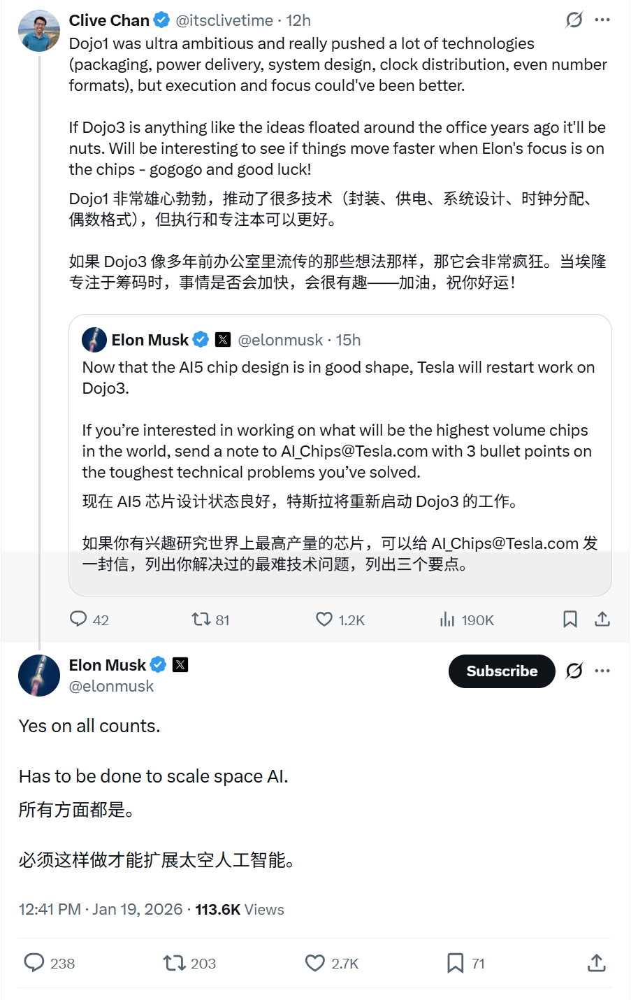
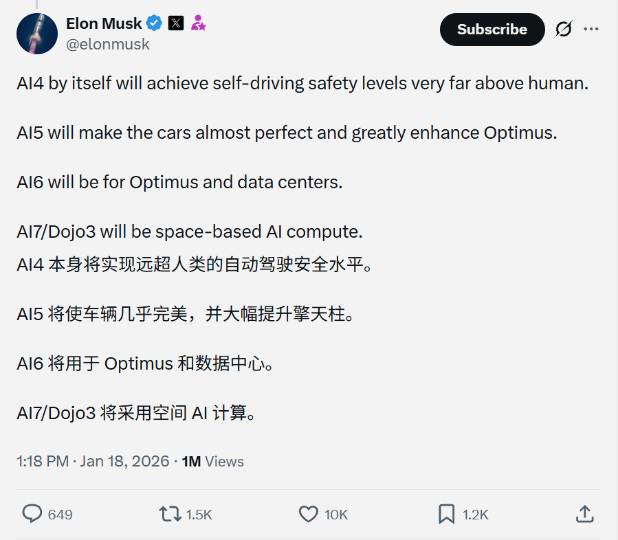
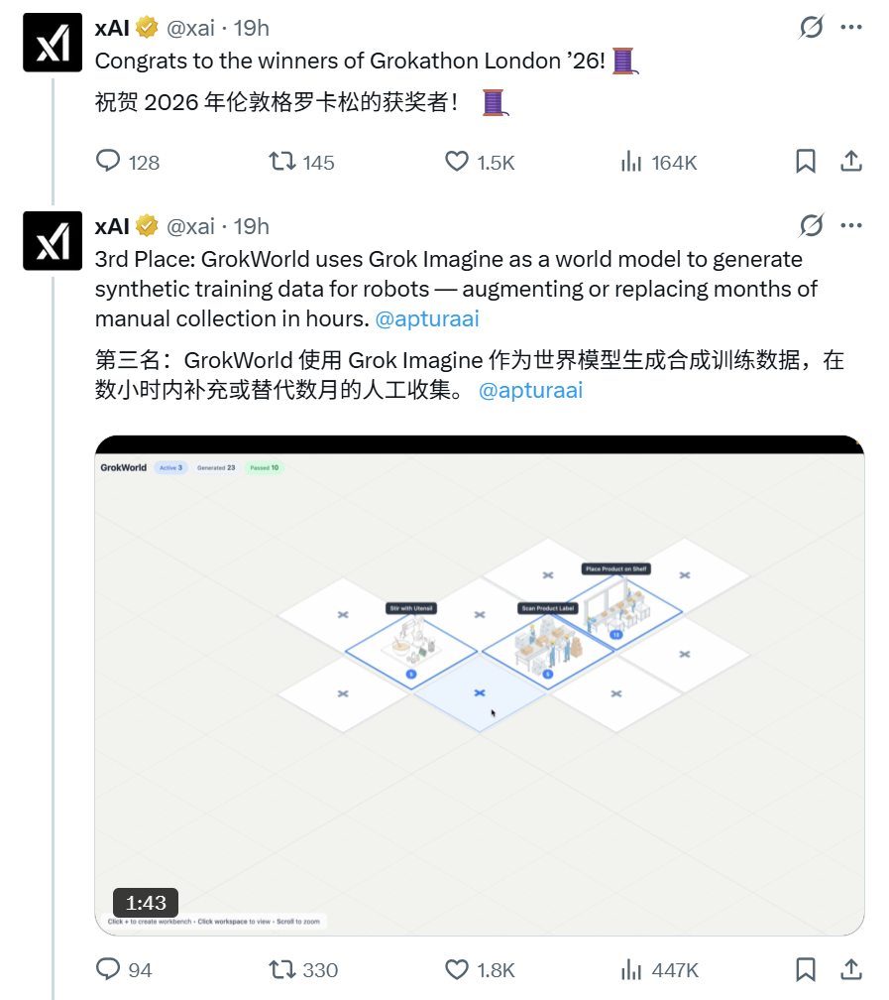
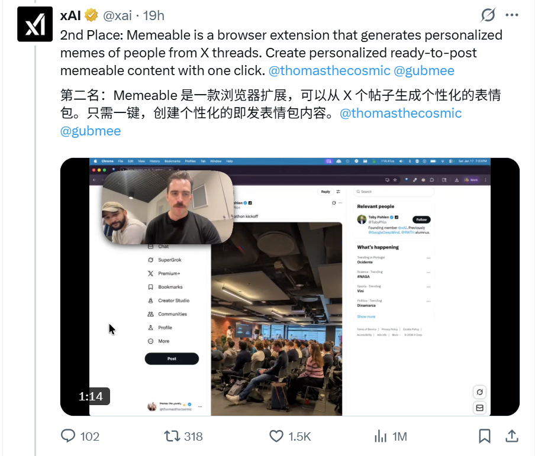
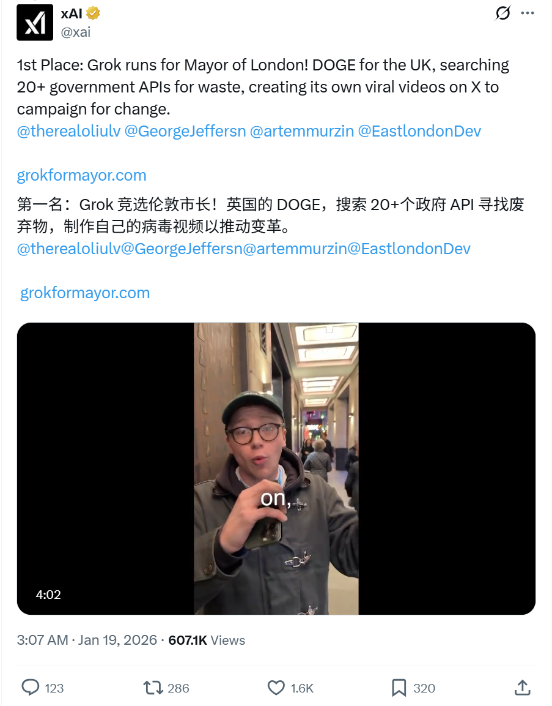
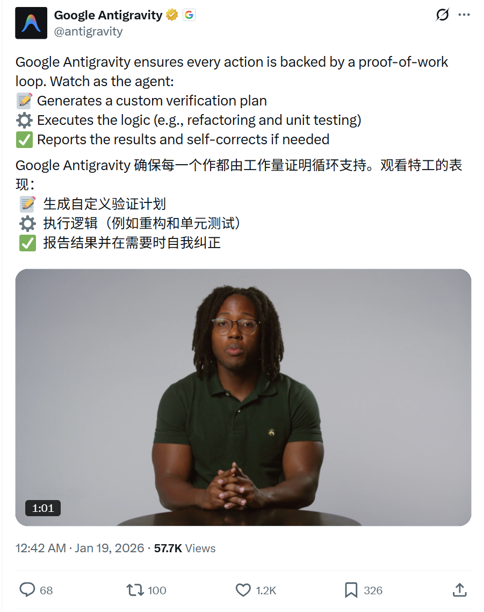

# 2026/01/19 硅谷AI圈动态

**时间范围**: 2026-01-18 05:00 UTC - 2026-01-19 05:00 UTC

### 概览表格
| 主题 | 关键事件 |
| :--- | :--- |
| **Tesla AI芯片战略** | Elon Musk 披露 AI4-AI7/Dojo3 完整路线图，并确认 Dojo3 重启用于太空 AI 规模化 |
| **Grokathon London** | xAI 公布黑客松获奖项目：Grok竞选伦敦市长(政府反浪费)、Memeable浏览器扩展、GrokWorld机器人训练数据 |
| **AI Agent** | Google Antigravity 演示 proof-of-work 循环：自动生成验证计划、执行重构/测试、自纠错机制 |

---

### 详细内容

#### 1. [Tesla/SpaceX] - [AI芯片路线图与 Dojo3 重启确认]
**发布者**: Elon Musk (@elonmusk)，Tesla/SpaceX/xAI CEO
**时间**: 2026-01-18 05:18 UTC - 2026-01-19 04:41 UTC
**核心内容**:
- **完整路线图**:
  - **AI4**: 自动驾驶安全水平将远超人类水平
  - **AI5**: 使汽车几乎完美，并大幅增强 Optimus 机器人能力
  - **AI6**: 将用于 Optimus 机器人和数据中心
  - **AI7/Dojo3**: 将用于太空 AI 计算
- **Dojo3 重启确认**: Musk确认重启Dojo3，认为必须这样做才能规模化空间 AI
- **战略意义**: Tesla/SpaceX 将 Dojo3 定位为太空 AI 基础设施的核心

**链接**: 

#### 2. [xAI] - [Grokathon London 获奖项目公布]
**发布者**: xAI (@xai)
**时间**: 2026-01-18 19:07 UTC
**核心内容**:
- **第一名 - Grok 竞选伦敦市长**:
  - "DOGE for UK" 理念，搜索 20+ 政府 API 发现浪费
  - 在 X 上创建病毒式竞选视频推动变革
  - 团队: @therealoliulv, @GeorgeJeffersn, @artemmurzin, @EastlondonDev
  - 网站: grokformayor.com
- **第二名 - Memeable 浏览器扩展**:
  - 根据 X 帖子线程生成个性化 meme
  - 一键生成可发布内容
  - 团队: @thomasthecosmic, @gubmee
- **第三名 - GrokWorld**:
  - 使用 Grok Imagine 作为世界模型生成机器人合成训练数据
  - 数小时内可替代数月人工数据收集
  - 团队: @apturaai

**链接**: 

#### 3. [Google] - [Antigravity Agent Proof-of-Work 循环演示]
**发布者**: Google Antigravity (@antigravity)
**时间**: 2026-01-18 16:42 UTC
**核心内容**:
- **核心机制**: Google Antigravity 确保每一个操作都由工作量证明循环支持
- **工作流程**:
  - 📝 生成自定义验证计划
  - ⚙️ 执行逻辑（如重构和单元测试）
  - ✅ 报告结果并在需要时自我纠正
- **演示视频**: 1分03秒，展示 agentic 开发平台界面生成验证计划和执行逻辑

**链接**: 

