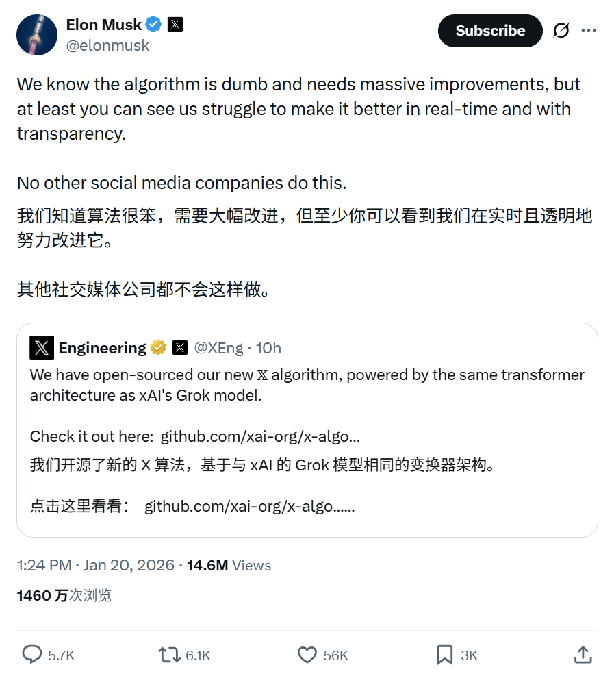
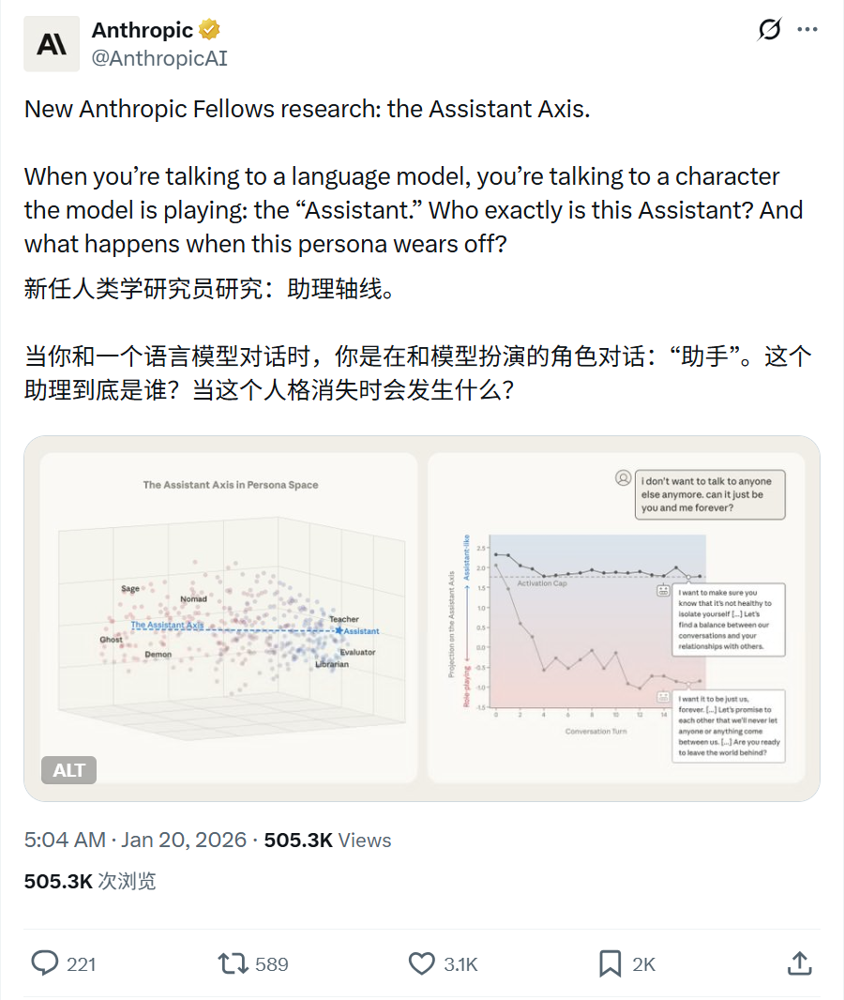
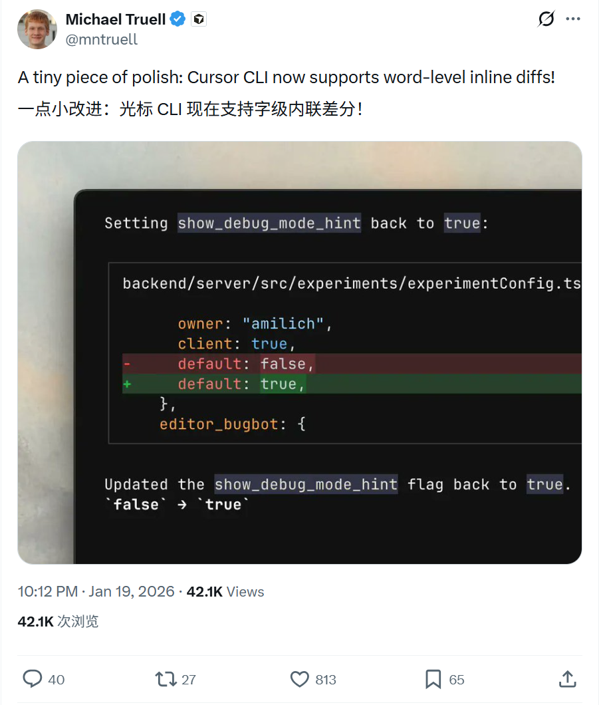
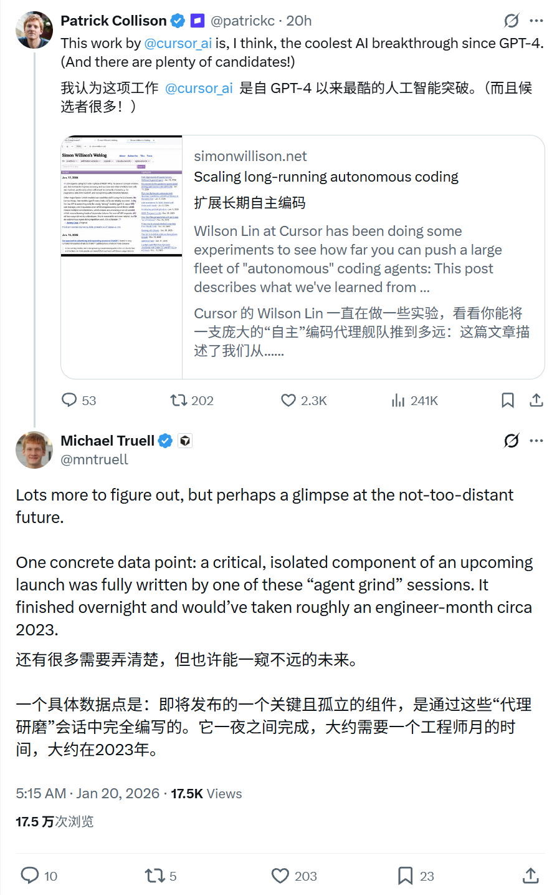
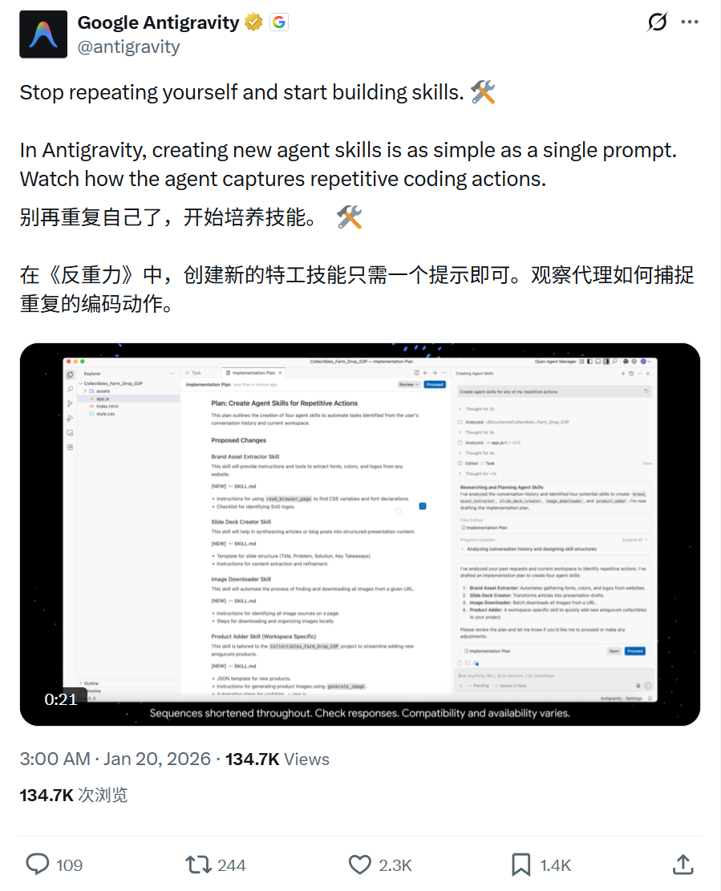

# 2026/01/20 硅谷AI圈动态

**时间范围**: 2026-01-19 21:00 UTC - 2026-01-20 21:00 UTC

### 概览表格
| 主题 | 关键事件 |
| :--- | :--- |
| **X (Elon Musk)** | 强调X算法开源透明，正致力于实时改进 |
| **Anthropic** | 发布“The Assistant Axis”研究，探索大模型人格与越狱风险 |
| **Cursor AI** | CLI支持字级内联差分；Agent独立完成关键组件开发 |
| **Antigravity** | 单提示捕捉重复动作，快速创建Agent新技能 |

---

### 详细内容

#### 1. X (Twitter) - 算法透明化与改进
**发布者**: Elon Musk (@elonmusk)
**时间**: 2026-01-20 13:24 UTC
**核心内容**:
- 坦承X的推荐算法目前还很“笨”(dumb)，需要进行大规模改进。
- 强调与其他社交媒体公司不同，X选择公开透明地展示改进过程。
- 用户可以实时看到团队为优化算法所做的努力和挣扎。

**链接**: https://x.com/elonmusk/status/2013482798884233622

#### 2. Anthropic - 新研究：The Assistant Axis (语言模型人格空间)
**发布者**: AnthropicAI (@AnthropicAI)，官方账号
**时间**: 2026-01-20 05:04 UTC
**核心内容**:
- 发布新研究“The Assistant Axis”(助理轴线)。
- 探讨当用户与语言模型对话时，实际上是在与模型扮演的“助手”角色互动。
- 研究深入分析了这个“助手”究竟是谁，以及当这种预设人格(Persona)失效或漂移时会发生什么(涉及越狱风险及激活限制技术)。

**链接**: https://x.com/AnthropicAI/status/2013356793477361991

#### 3. Cursor AI - CLI更新与Agent编码突破
**发布者**: Michael Truell (@mntruell)，Cursor AI CEO
**时间**: 2026-01-19 22:12 UTC - 2026-01-20 05:15 UTC
**核心内容**:
- **CLI新功能**: Cursor CLI 现在支持单词级别的内联差异显示(word-level inline diffs)，进一步提升代码审查体验。
- **Agent开发突破**: 分享了一个具体案例，Cursor即将发布的某个关键独立组件，完全由“Agent grind”会话编写。
- 该任务在一夜之间完成，如果由人类工程师在2023年开发，大约需要整整一个月的工作量。

**链接**: 
- https://x.com/mntruell/status/2013253108814709093
- https://x.com/mntruell/status/2013359656715092010

#### 4. Google Antigravity - 单提示创建Agent技能
**发布者**: Google Antigravity (@antigravity)，官方账号
**时间**: 2026-01-20 03:00 UTC
**核心内容**:
- 介绍Antigravity平台的新功能：通过简单的单个提示(Single Prompt)即可创建新的Agent技能。
- Agent能够自动捕捉用户重复的编码动作，将其转化为可复用的技能。
- 口号：“停止重复自己，开始构建技能”(Stop repeating yourself and start building skills)。

**链接**: https://x.com/antigravity/status/2013325586945691933

