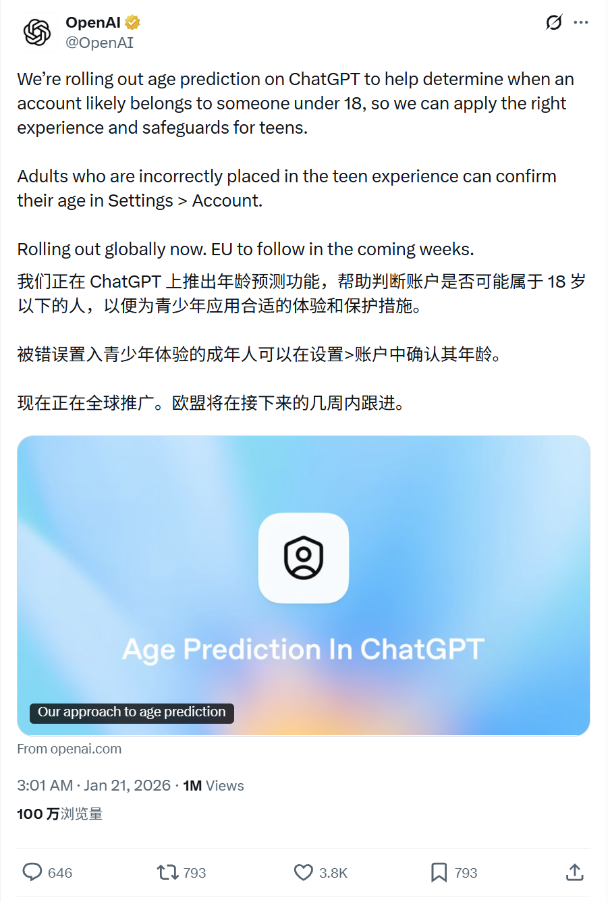
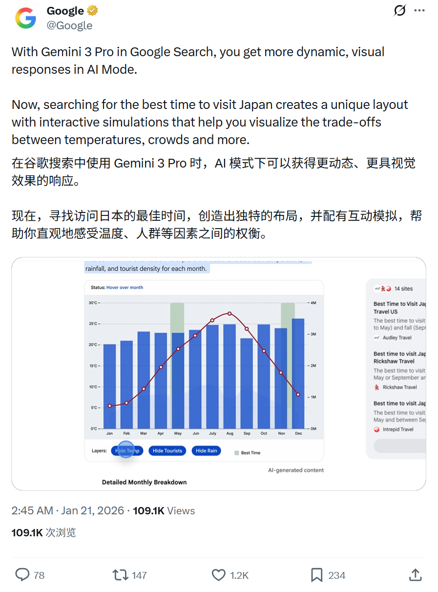
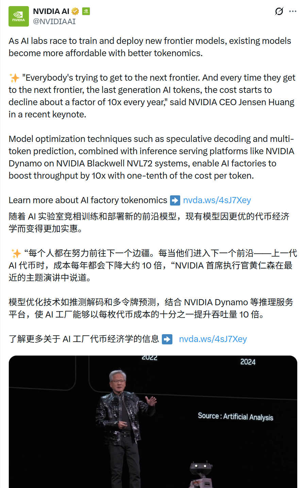

# 2026/01/21 硅谷AI圈动态

**时间范围**: 2026-01-21 01:45 - 19:00 北京时间

---

## 📊 总览

过去24小时内AI生态活跃于实际落地应用，特别是健康领域和Agent工具链；Google/DeepMind生态强调生成与开发工具；Anthropic与OpenAI聚焦用户安全与隐私功能；计算资源持续强化，无明显治理或法律争议事件。

| 主题 | 关键事件 |
| :--- | :--- |
| **用户安全** | ChatGPT推出年龄预测功能，强化青少年保护 |
| **搜索体验** | Google Search集成Gemini 3 Pro，提供更动态视觉响应 |
| **健康数据隐私** | Claude新增健康数据安全连接，支持Apple Health等平台 |
| **AI药物研发** | Isomorphic Labs与强生达成合作，利用AI设计引擎攻克难药靶点 |
| **AI+医疗健康** | OpenAI推出Horizon 1000计划，5000万美元支持非洲1000家诊所 |
| **计算资源** | OpenAI Podcast讨论计算稀缺性；NVIDIA推出Dynamo+Blackwell提升吞吐10x |

---

## 🔥 重点帖子详情

#### 1. OpenAI - ChatGPT年龄预测功能

**发布者**: OpenAI (@OpenAI)
**时间**: 2026-01-21 03:01 北京时间
**核心内容**:
- **功能目的**：帮助判断账户是否可能属于18岁以下用户，为青少年应用合适的体验和保护措施
- **误判处理**：被错误识别的成年人可在"设置>账户"中确认年龄
- **推出进度**：全球rollout中，欧盟将在未来几周跟进

**链接**: https://x.com/OpenAI/status/2013688237772898532

---

#### 2. Google - Gemini 3 Pro搜索体验升级

**发布者**: Google (@Google)
**时间**: 2026-01-21 02:45 北京时间
**核心内容**:
- **功能升级**：Gemini 3 Pro在Google Search中提供更动态、更具视觉效果的响应
- **交互体验**：搜索"访问日本的最佳时间"可生成独特布局，包含交互式模拟，帮助用户直观权衡温度、人群等因素
- **发布节奏**：目前美国用户可用，Google AI Pro & Ultra 订阅者的额度更高

**链接**: https://x.com/Google/status/2013684372033900557

---

#### 3. Anthropic Claude - 健康数据安全连接

**发布者**: Claude (@claudeai)
**时间**: 2026-01-21 07:22 北京时间
**核心内容**:
- **新功能发布**：Claude现可安全连接健康数据（beta阶段），美国Pro和Max用户可使用
- **支持平台**：Apple Health (iOS)、Health Connect (Android)、HealthEx、Function Health
- **隐私优先**：集成设计以隐私为核心，需明确选择加入，健康信息绝不用于训练
- **实用功能**：可总结病史、解释检测结果、分析健康指标趋势

**链接**: https://x.com/claudeai/status/2013754136265621952

---

#### 4. DeepMind/Isomorphic Labs - AI药物设计合作

**发布者**: Demis Hassabis (@demishassabis)，DeepMind CEO
**时间**: 2026-01-21 19:00 北京时间
**核心内容**:
- **合作宣布**：Isomorphic Labs与Johnson & Johnson Innovation达成合作
- **技术整合**：将Isomorphic Labs的AI药物设计引擎与强生世界级药物开发能力结合
- **目标突破**：共同攻克历来难以药物化的疾病靶点，推动数字生物学发展

**链接**: https://x.com/demishassabis/status/2013929712779677927

---

#### 5. OpenAI - Horizon 1000医疗援助计划

**发布者**: OpenAI (@OpenAI)
**时间**: 2026-01-21 13:13 北京时间
**核心内容**:
- **项目规模**：5000万美元新项目，与盖茨基金会合作
- **覆盖范围**：支持非洲国家1000家诊所加强初级保健
- **双重支持**：结合资金援助与AI技术支持，帮助卫生领导者服务社区

**链接**: https://x.com/OpenAI/status/2013842364763136418

---

#### 6. OpenAI - 计算资源稀缺性讨论

**发布者**: OpenAI (@OpenAI)
**时间**: 2026-01-21 07:29 北京时间
**核心内容**:
- **核心议题**：计算是AI领域最稀缺的资源，需求持续增长
- **对话嘉宾**：CFO Sarah Friar与Khosla Ventures创始人Vinod Khosla
- **讨论方向**：如何满足计算需求并让更多人受益于AI

**链接**: https://x.com/OpenAI/status/2013755708110709135

---

#### 7. NVIDIA - AI工厂Token经济与性能提升

**发布者**: NVIDIA AI (@NVIDIAAI)
**时间**: 2026-01-21 04:00 北京时间
**核心内容**:
- **成本趋势**：前沿模型训练加速，旧模型token成本每年下降约10倍
- **CEO引述**："每个人都在努力前往下一个前沿，每当到达新前沿，上一代 AI Token 成本就会大幅下降"
- **技术方案**：NVIDIA Dynamo + Blackwell NVL72系统可提升吞吐量10倍，成本降至十分之一

**链接**: https://x.com/NVIDIAAI/status/2013703075672752267

