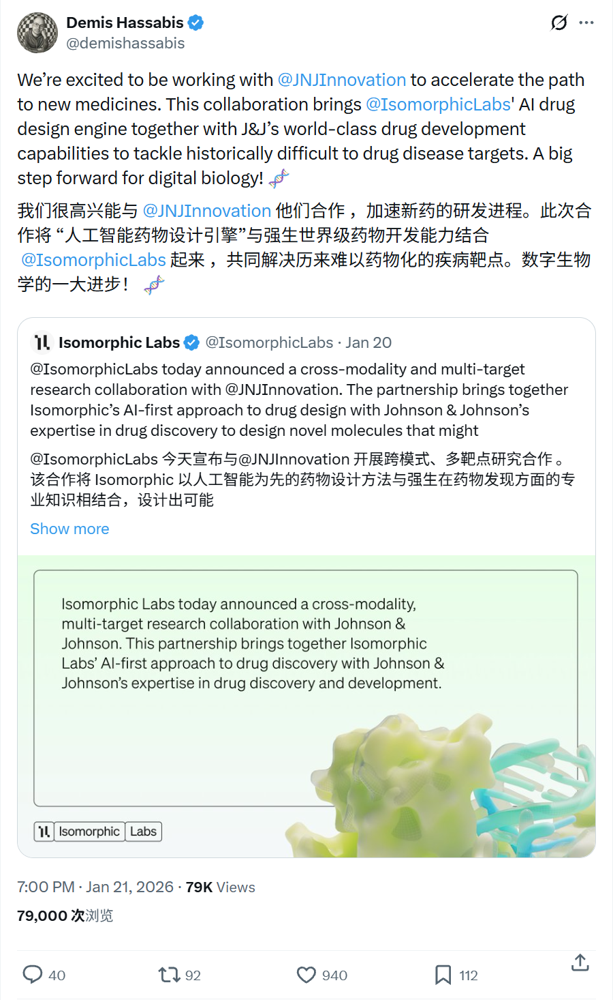
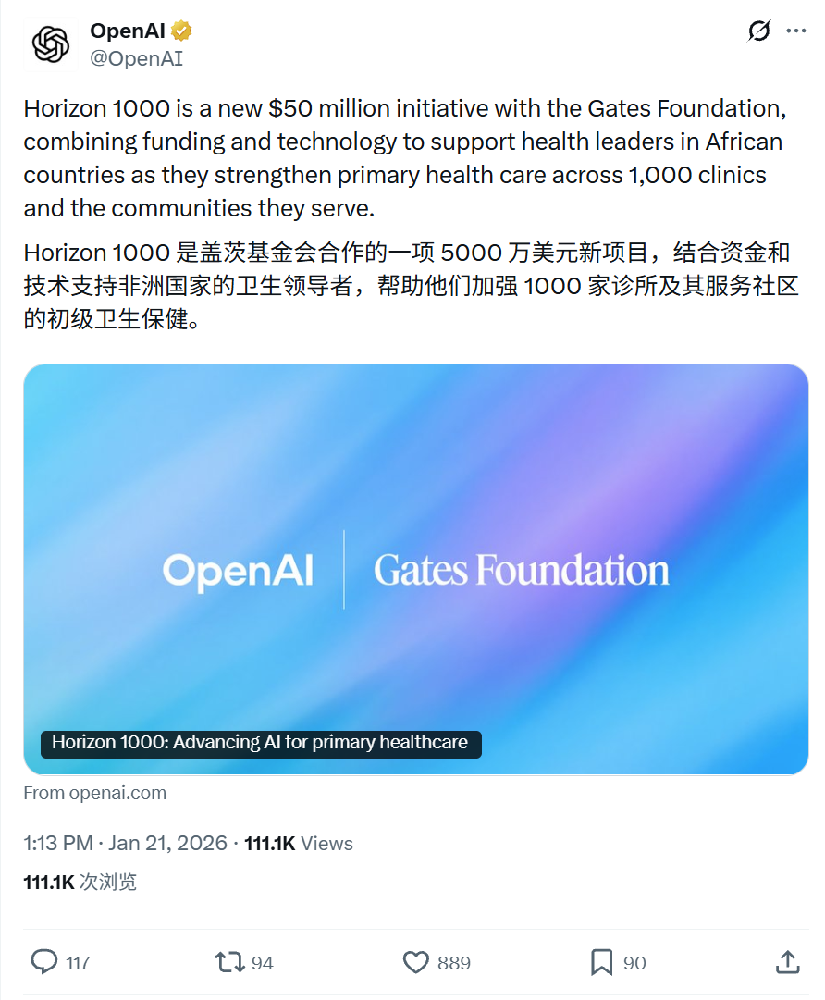

# 2026/01/21 硅谷AI圈动态

**时间范围**：2026-01-20 14:52 UTC 至 2026-01-20 16:54 UTC

---

## 📊 总览

过去 24 小时内，AI 领域以产品更新（Gemini/Anthropic）、研究发布和行业合作为主，无重大突破性新闻。

| 主题 | 关键事件 |
|------|----------|
| **Cursor / AI 代理** | Cursor CEO 分享 AI 代理最佳实践经验 |
| **Google Gemini** | Gemini 扩展至 70+ 语言，新增 23 种语言支持 |
| **NVIDIA** | Jensen Huang 将出席达沃斯论坛讨论 AI 经济增长 |
| **Anthropic** | 与 TeachForAll 合作，向 63 国教育者提供 Claude 培训 |

---

## 🔥 重点帖子详情

### 1. Cursor - AI 代理最佳实践分享

**发布者**：Michael Truell (@mntruell)，Cursor CEO
**时间**：2026-01-20 15:37 UTC

**核心内容**：
- **规划优先**：使用 Shift+Tab 计划模式开始任务
- **智能上下文管理**：让 Cursor 自主搜索，避免过度标记上下文
- **测试驱动开发（TDD）**：将测试作为反馈循环，持续迭代直至通过
- **回滚策略**：当方向偏离时，及时回退、收紧计划后重新执行
- **对话连续性**：保持长对话简短，使用 @ Past Chats 实现上下文延续
- **规则文件**：为重复性错误添加轻量级的 `.cursor/rules` 配置
- **技能与钩子**：用于长期"持续改进直到测试通过"的循环
- **并行化**：通过 worktrees 并行运行多个代理/模型

**相关帖子**：
- [Michael Truell (@mntruell) - Cursor 使用技巧](https://x.com/mntruell/status/2013636888242835810)

---

### 2. Google Gemini - 多语言扩展

**发布者**：Google Gemini (@GeminiApp)
**时间**：2026-01-20 16:41 UTC

**核心内容**：
- **语言扩展**：Gemini 正式扩展至 23 种新语言
- **覆盖范围**：现已在所有平台/界面上支持 70+ 种语言
- **用户价值**：更多用户可以用母语进行头脑风暴、内容创作和复杂任务处理
- **全球化战略**：进一步推动 AI 技术在全球范围内的普及和可访问性

**相关帖子**：
- [Google Gemini (@GeminiApp) - 语言扩展公告](https://x.com/GeminiApp/status/2013653045662367970)

---

### 3. NVIDIA - 达沃斯论坛 AI 经济讨论

**发布者**：NVIDIA (@nvidia)
**时间**：2026-01-20 16:54 UTC

**核心内容**：
- **论坛参与**：NVIDIA CEO Jensen Huang（黄仁勋）将出席达沃斯世界经济论坛
- **对话主题**："AI 如何推动就业创造、增长和生产力"
- **合作嘉宾**：与 BlackRock CEO Larry Fink 共同讨论
- **活动时间**：2026 年 1 月 21 日 11:30-12:00 CET
- **核心议题**：
  - AI 驱动的经济增长
  - 新就业机会创造
  - 全球经济生产力提升

**相关帖子**：
- [NVIDIA (@nvidia) - 达沃斯论坛公告](https://x.com/nvidia/status/2013656419023622503)

---

### 4. Anthropic - 全球教育者 AI 培训计划

**发布者**：Anthropic (@AnthropicAI)
**时间**：2026-01-20 14:52 UTC

**核心内容**：
- **合作伙伴**：与 TeachForAll 达成全球合作
- **覆盖范围**：为 63 个国家的教育工作者提供 AI 培训
- **影响力**：服务超过 150 万学生的教师
- **应用场景**：
  - 课程规划（Curricula Planning）
  - 作业个性化定制（Customize Assignments）
  - 教学工具构建（Build Tools）
- **反馈机制**：教育者可提供反馈，帮助塑造 Claude 的未来发展方向
- **社会意义**：推动 AI 技术在全球教育领域的负责任应用

**相关帖子**：
- [Anthropic (@AnthropicAI) - TeachForAll 合作公告](https://x.com/AnthropicAI/status/2013625608157212785)

---
