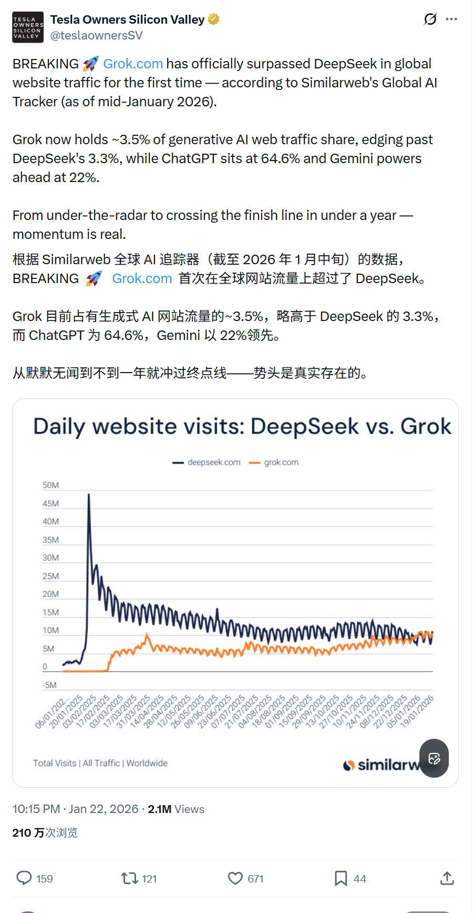
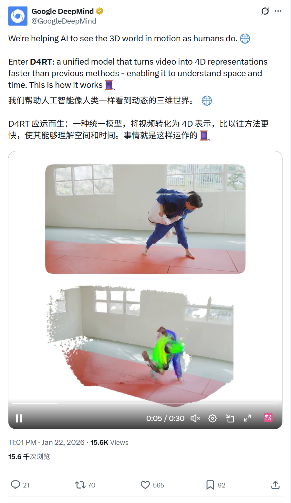
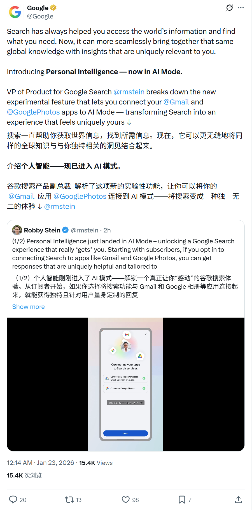
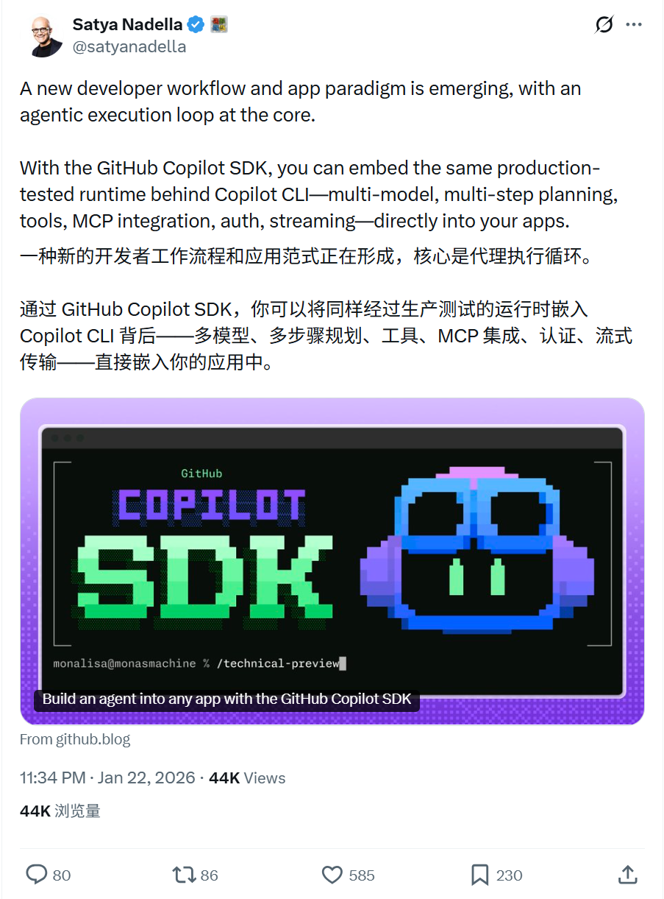
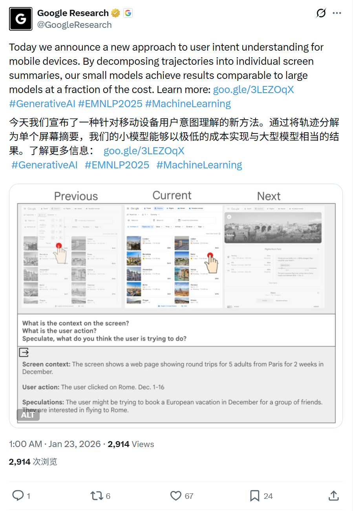
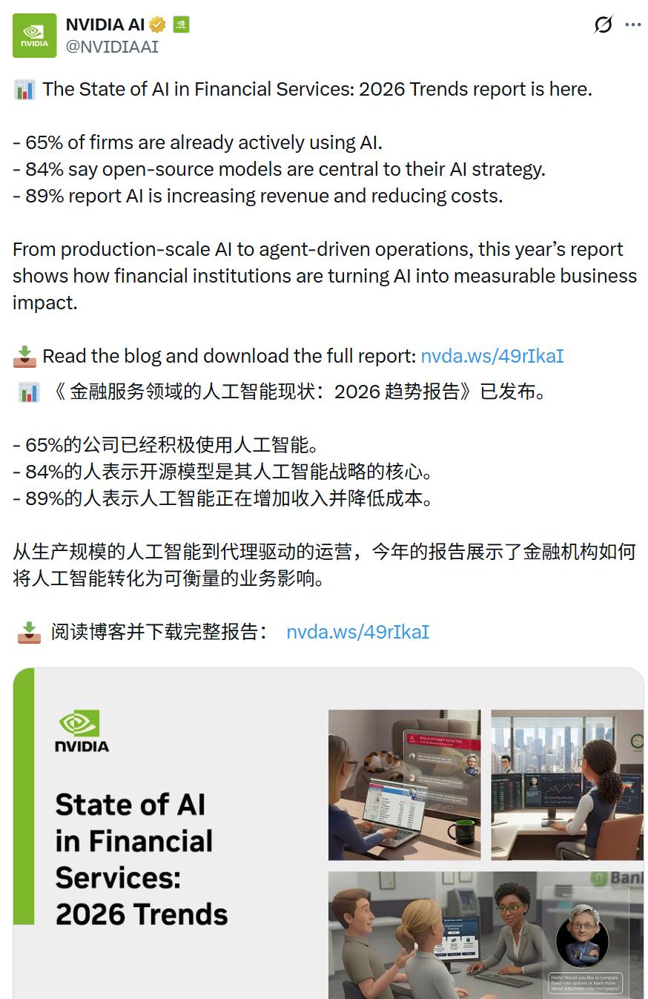
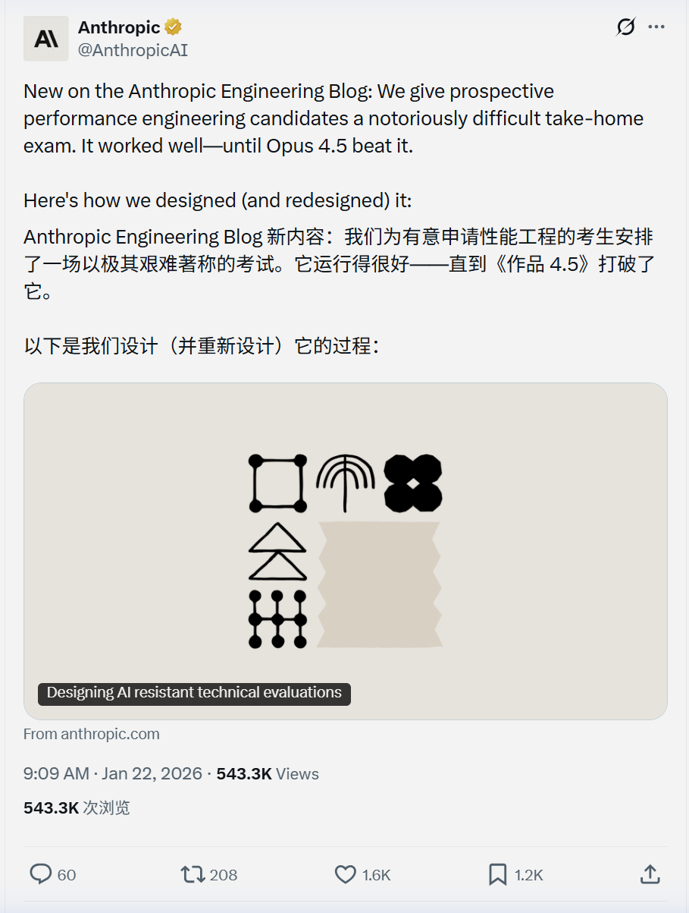

# 2026/01/22 硅谷AI圈动态

**时间范围**: 2026-01-21 17:09 UTC - 2026-01-22 17:00 UTC

---

## 📊 总览

过去24小时内，相关账号活跃度较高，硅谷AI圈持续强化AI产品实用性和研究深度，包括AI个性化体验、Agent工具开发、多模态/4D视觉研究等。无明显业界治理、融资或法律争议事件。

| 主题 | 关键事件 |
| :--- | :--- |
| **XAI** | Grok网站流量首次超越DeepSeek，占据生成式AI市场3.5%份额 |
| **4D视觉** | Google DeepMind发布D4RT模型，4D场景重建速度提升18-300倍 |
| **AI搜索** | Google推出Personal Intelligence功能，连接Gmail/Photos实现个性化AI搜索 |
| **开发者工具** | GitHub Copilot SDK发布，支持将agentic执行循环嵌入应用 |
| **移动端AI** | Google Research提出小模型方案，以低成本实现移动端意图理解 |
| **行业报告** | NVIDIA发布金融AI报告：65%机构已用AI，89%报告收入增长 |
| **AI伦理** | Anthropic发布Claude新宪法，公开AI训练价值观指南 |

---

## 🔥 重点帖子详情

#### 1. xAI - Grok流量突破

**发布者**: Elon Musk (@elonmusk)  
**时间**: 2026-01-22 22:55 北京时间  
**核心内容**:
- **流量里程碑**: Grok.com网站流量首次超越DeepSeek，成为生成式AI领域的重要玩家
- **市场份额**: Grok 目前占据全球生成式AI网页流量约3.5%的份额

**链接**: https://x.com/elonmusk/status/2014351144370266231  

---

#### 2. Google DeepMind - D4RT 4D视觉模型

**发布者**: Google DeepMind (@GoogleDeepMind)  
**时间**: 2026-01-22 23:01 北京时间  
**核心内容**:
- **技术突破**: 发布D4RT统一模型，将视频转化为4D表示（空间+时间），帮助AI像人类一样理解动态3D世界
- **性能提升**: 相比以往方法，速度提升18-300倍
- **应用场景**: 支持机器人导航、增强现实(AR)、世界模型构建、运动跟踪、3D重建等多种应用
- **技术原理**: 通过分解视频轨迹，实现对空间和时间的统一理解

**链接**: https://x.com/GoogleDeepMind/status/2014352808426807527  

---

#### 3. Google - Personal Intelligence个性化搜索

**发布者**: Google (@Google)  
**时间**: 2026-01-23 00:14 北京时间  
**核心内容**:
- **新功能发布**: 在AI Mode中推出"Personal Intelligence"实验性功能
- **个性化能力**: 允许订阅用户连接Gmail和Google Photos，将全球知识与个人数据结合，让搜索结果更定制化
- **上线节奏**: 美国Google AI Pro 和 Ultra 订阅用户可以在该功能上线时自动使用
- **产品定位**: 作为Google Labs实验特性，标志着搜索从通用信息检索向个性化智能助手转型

**链接**: https://x.com/Google/status/2014371079720935745  

---

#### 4. Microsoft - GitHub Copilot SDK发布

**发布者**: Satya Nadella (@satyanadella)，Microsoft CEO  
**时间**: 2026-01-22 23:34 北京时间  
**核心内容**:
- **开发范式转变**: 新的开发者工作流和应用范式正在形成，核心是agentic执行循环
- **SDK能力**: GitHub Copilot SDK允许开发者将Copilot CLI背后的生产级运行时直接嵌入应用
- **技术特性**: 支持多模型协作、多步骤规划、工具集成、MCP集成、身份验证、流式传输等完整能力
- **生态意义**: 将AI agent能力从IDE扩展到任意应用场景，推动AI原生应用开发

**链接**: https://x.com/satyanadella/status/2014360953111060894  

---

#### 5. Google Research - 移动端意图理解新方法

**发布者**: Google Research (@GoogleResearch)  
**时间**: 2026-01-23 01:00 北京时间  
**核心内容**:
- **研究创新**: 提出移动设备用户意图理解的新方法
- **技术路径**: 将用户操作轨迹分解为单个屏幕摘要，降低计算复杂度
- **性能对比**: 小模型以极低成本实现了与大模型相当的效果
- **实用价值**: 为移动端AI应用提供高效、低成本的意图理解方案，适合资源受限的设备

**链接**: https://x.com/GoogleResearch/status/2014382737482727427  

---

#### 6. NVIDIA - 2026金融服务AI现状报告

**发布者**: NVIDIA AI (@NVIDIAAI)  
**时间**: 2026-01-22 22:15 北京时间  
**核心内容**:
- **行业渗透率**: 65%的金融机构已经积极使用AI技术
- **技术选型**: 84%的机构表示开源模型是其AI战略的核心
- **业务影响**: 89%的机构报告AI带来了收入增长或成本降低
- **应用趋势**: 从生产规模AI到agent驱动的运营，金融机构正在将AI转化为可衡量的业务价值

**链接**: https://x.com/NVIDIAAI/status/2014341031190303132  

---

#### 7. Anthropic - Claude新宪法与性能工程挑战

**发布者**: Anthropic (@AnthropicAI)  
**时间**: 2026-01-22 09:09 北京时间  
**核心内容**:
- **AI宪法公开**: 发布Claude的新"宪法"（Constitutional AI），详细阐述AI行为的价值观指南，并直接用于模型训练
- **透明度提升**: 公开AI训练的伦理框架，增强用户对AI决策过程的理解
- **招聘考试趣闻**: 分享性能工程岗位的高难度考试，Opus 4.5已能破解该考试，但人类候选人仍保持领先
- **技术迭代**: 因AI能力提升，团队需要重新设计更具挑战性的考核标准

**链接**: https://x.com/AnthropicAI/status/2014143403144200234  

