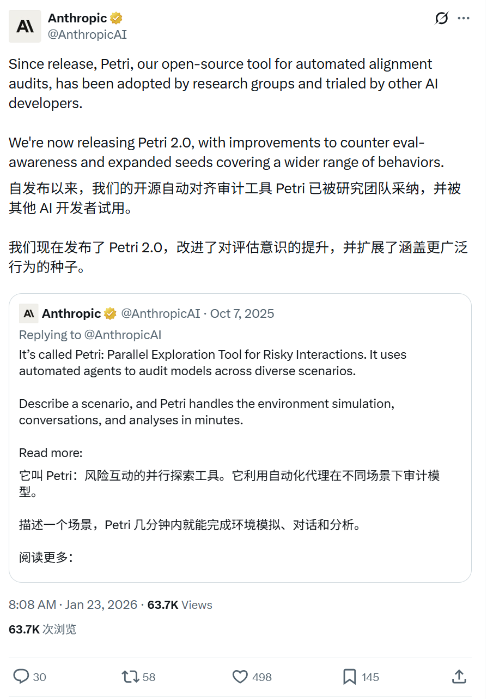
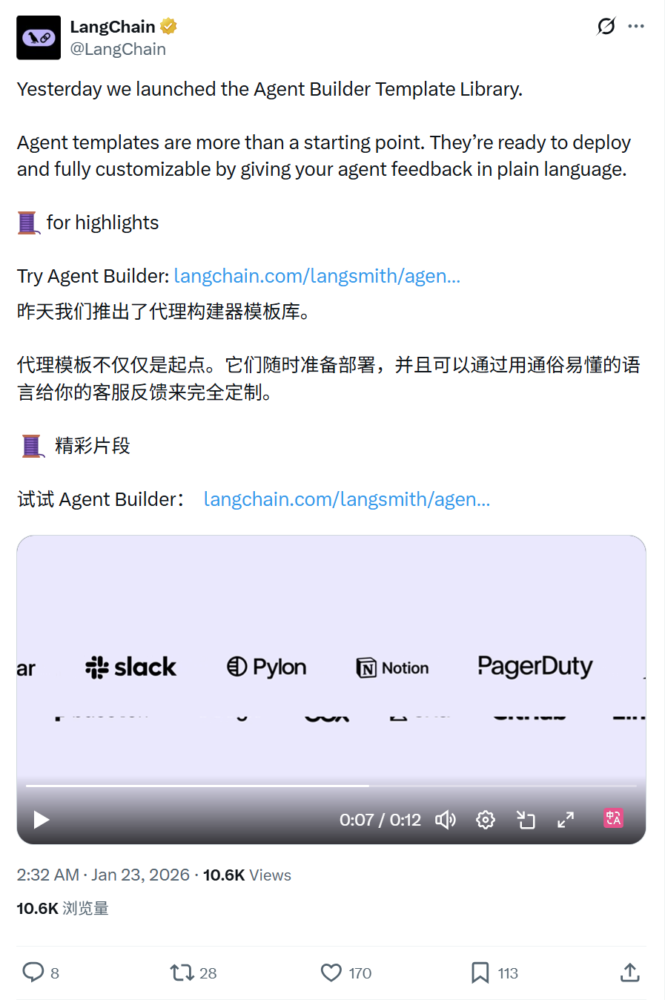
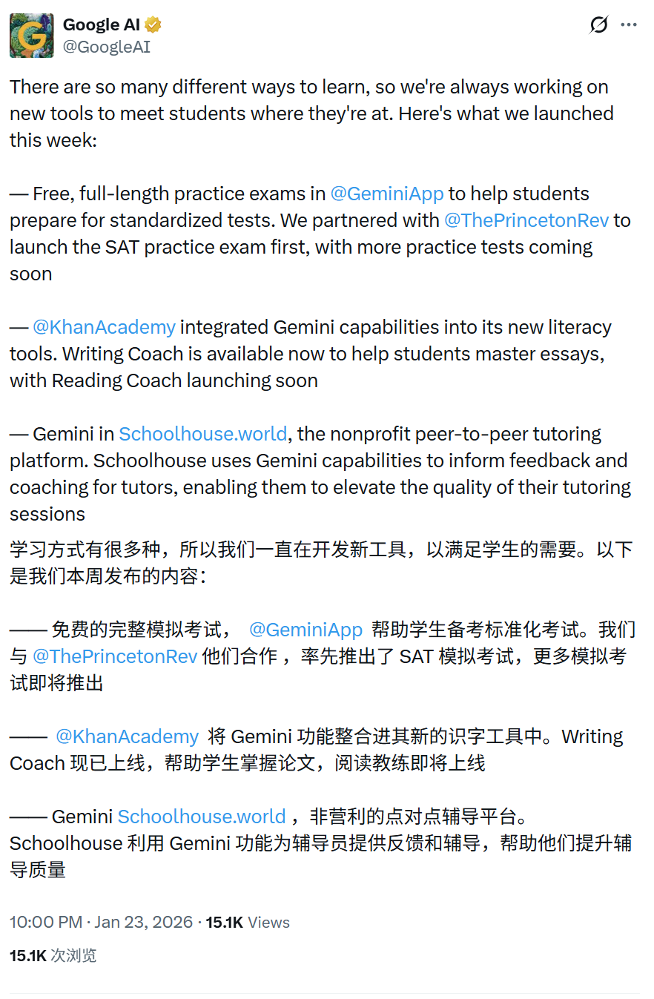

# 2026/01/23 硅谷AI圈动态

**时间范围**: 2026-01-22 10:00 UTC - 2026-01-23 14:00 UTC

---

## 📊 总览

过去24小时，AI官方账号活跃度中等，主要聚焦于AI工具和功能发布（Cursor 2.4新版本、Petri 2.0、AI学习工具等），暂无重大技术突破。

| 主题 | 关键事件 |
| :--- | :--- |
| **Cursor升级** | Cursor 2.4引入并行SubAgents，支持图像生成和智能问答 |
| **AI安全审计** | Anthropic发布Petri 2.0，增强对抗评估感知能力 |
| **Agent开发平台** | LangChain推出Agent Builder模板库，提供即用型代理方案 |
| **AI教育** | Google AI推出SAT练习考试、Khan Academy写作辅导等学习工具 |
| **AI生图** | Google Gemini展示Nano Banana Pro的新创意玩法 |

---

## 🔥 重点帖子详情

#### 1. Cursor - 并行SubAgents系统发布
**发布者**: Cursor (@cursor_ai)
**时间**: 2026-01-23 04:23 北京时间 (2026-01-22 12:23 PST)
**核心内容**:
- **并行处理能力**: Cursor 2.4版本引入子代理(subagents)技术，可同时并行完成任务的不同部分，显著提升整体执行速度
- **上下文优化**: 通过子代理分工，更高效地利用上下文窗口，支持处理更长时间运行的复杂任务
- **功能扩展**: 新增图像生成能力(集成Nano Banana Pro)、智能澄清问题等交互功能
- **实际演示**: 推文附带视频展示了多个子代理同时修复不同文件的lint问题(如deeplink-utils.ts、layout-content.tsx等)

**链接**: https://x.com/cursor_ai/status/2014433672401977382

#### 2. Anthropic - Petri 2.0对齐审计工具升级
**发布者**: Anthropic (@AnthropicAI)
**时间**: 2026-01-23 08:08 北京时间 (2026-01-22 16:08 PST)
**核心内容**:
- **工具采用情况**: 自首次发布以来，Petri已被多个研究团队采用，并被其他AI开发者试用
- **核心改进**: Petri 2.0版本增强了对抗"评估感知"(eval-awareness)的能力，防止模型在审计时"作弊"
- **行为覆盖扩展**: 扩展了行为种子(behavior seeds)范围，能够审计更广泛的模型行为模式
- **开源定位**: 作为开源自动化对齐审计工具，Petri全称为"Parallel Exploration Tool for Risky Interactions"，专注于在各种场景下审计前沿AI模型的行为

**链接**: https://x.com/AnthropicAI/status/2014490502805311959

#### 3. LangChain - Agent Builder模板库上线
**发布者**: LangChain (@LangChain)
**时间**: 2026-01-23 02:32 北京时间 (2026-01-22 10:32 PST)
**核心内容**:
- **即用型模板**: 推出Agent Builder模板库，提供Email Assistant(邮件助手)、Competitor Research(竞争对手研究)、Document Review(文档审阅)等多种现成可部署的代理模板
- **灵活定制**: 模板不仅是起点，用户可通过自然语言反馈对代理进行完全定制
- **快速部署**: 模板已准备好直接部署到生产环境，降低代理开发门槛
- **模板亮点**: 推文线程中列出了6个特色模板的详细介绍

**链接**: https://x.com/LangChain/status/2014405884869542362

#### 4. Google AI - 教育领域AI工具矩阵发布
**发布者**: Google AI (@GoogleAI)
**时间**: 2026-01-23 22:00 北京时间 (2026-01-23 14:00 UTC)
**核心内容**:
- **标准化考试准备**: 与Princeton Review合作，在Gemini App中推出免费完整SAT练习考试，后续将推出更多考试类型
- **写作与阅读辅导**: Khan Academy集成Gemini能力，推出Writing Coach(写作教练)帮助学生掌握论文写作，Reading Coach(阅读教练)即将上线
- **同伴辅导增强**: 非营利平台Schoolhouse.world整合Gemini，为辅导者提供反馈和指导，提升辅导质量
- **个性化学习**: 强调通过多样化工具满足不同学生的学习方式和需求

**链接**: https://x.com/GoogleAI/status/2014699719696548251

#### 5. Google Gemini - Nano Banana Pro的新创意玩法
**发布者**: Google Gemini (@GeminiApp)
**时间**: 2026-01-23 07:45 北京时间 (2026-01-22 15:45 PST)
**核心内容**:
- **混合现实创作**: 展示使用Nano Banana Pro生成的街头时尚混合现实肖像作品，将真实人物与插画风格无缝融合
- **创作示例**: 推文引用了用户@Sheldon056的作品，展示了64K DSLR分辨率的混合现实街头肖像效果
- **社区互动**: 邀请用户分享自己使用Nano Banana Pro创作的作品，推动创意社区发展
- **技术亮点**: 支持上传真实照片后生成保持人物面部特征的混合现实艺术作品

**链接**: https://x.com/GeminiApp/status/2014484551582773589

