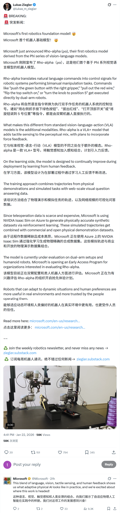
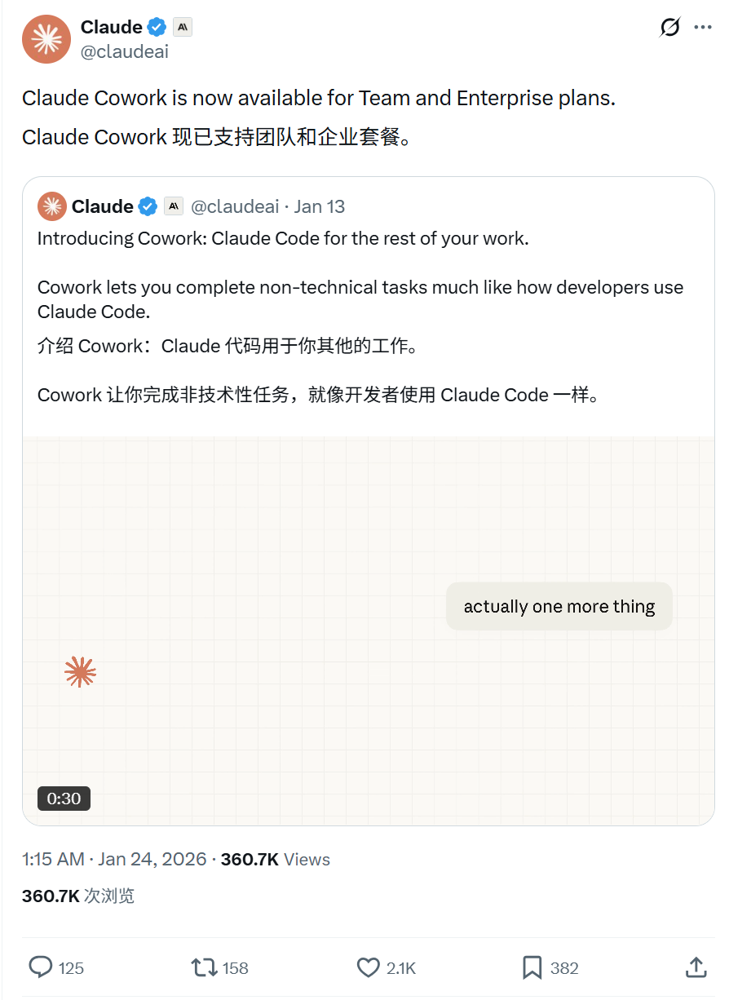
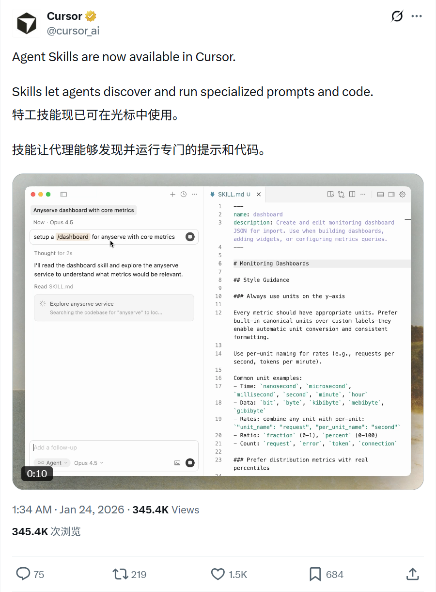
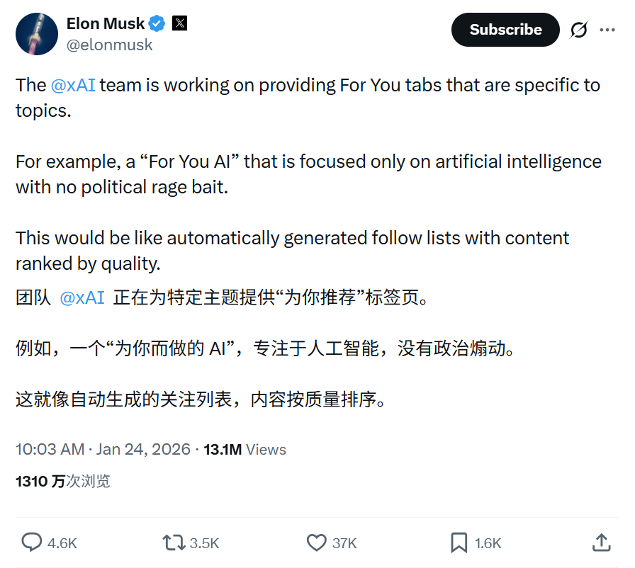
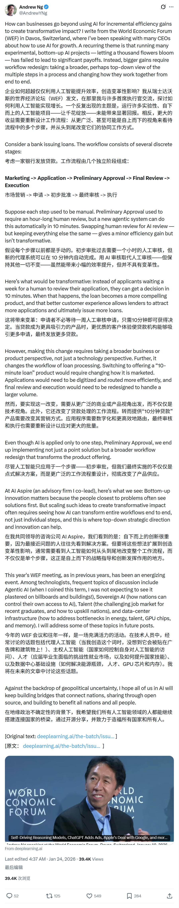
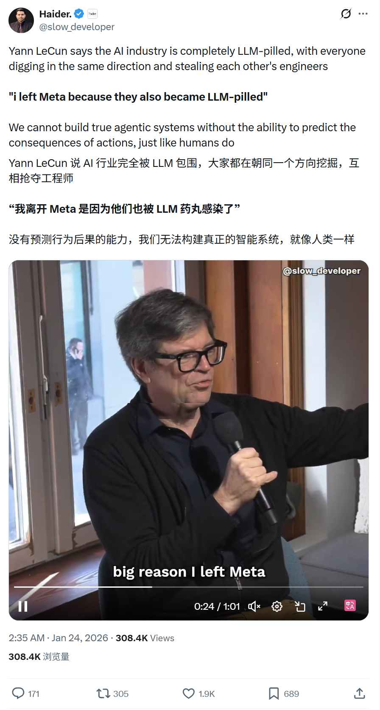

# 2026/01/24 硅谷AI圈动态

**时间范围**: 2026-01-23 16:00 UTC - 2026-01-24 16:00 UTC

---

## 📊 总览

过去24小时，相关账号整体节奏活跃但不算爆炸式，主要是新模型（Microsoft Rho-alpha）或新功能（Claude、Cursor、xAI）更新，学术界大佬吴恩达和Yann LeCun也分别发表了对AI改变企业工作流程和AGI的观点。

| 主题 | 关键事件 |
| :--- | :--- |
| **Microsoft** | 发布机器人基础模型 Rho-alpha，展示自适应物理AI潜力 |
| **Anthropic** | Claude正式登陆Excel，Cowork功能面向团队版开放 |
| **Cursor** | 上线 Agent Skills，允许Agent执行自定义Prompt和代码 |
| **xAI** | 开发基于话题的"For You"标签页，过滤政治干扰 |
| **AI观点** | 吴恩达探讨AI如何推动企业转型，LeCun驳斥AGI速成论 |

---

## 🔥 重点帖子详情

#### 1. Microsoft - 机器人基础模型 Rho-alpha
**发布者**: Microsoft (@Microsoft)
**时间**: 2026-01-23 19:38 PST
**核心内容**:
- **模型发布**: 推出了 **Rho-alpha**，展示了语言、视觉、触觉感知和人类反馈的融合。
- **物理AI**: 称此为"自适应物理AI (**Adaptive Physical AI**)"的实际应用，能够适应环境变化。
- **未来展望**: 微软对该技术在机器人领域的应用前景表示兴奋。

**链接**: [Tweet](https://x.com/Microsoft/status/2014784921672274077)

#### 2. Anthropic - Claude产品更新：Excel集成与Cowork
**发布者**: Claude (@claudeai)
**时间**: 2026-01-23 22:56 PST
**核心内容**:
- **Excel集成**: Claude现已在 **Pro计划** 中可用。支持拖拽多文件、避免覆盖现有单元格、并通过自动压缩处理更长的会话。
- **Cowork更新**: **Claude Cowork** 现已面向团队(Team)和企业(Enterprise)计划开放，进一步增强协作能力。
- **效率提升**: 旨在帮助用户更流畅地进行数据分析和团队合作。

**链接**: 
- [Excel Update](https://x.com/claudeai/status/2014834616889475508)
- [Cowork Update](https://x.com/claudeai/status/2014748923278311855)

#### 3. Cursor - Agent Skills 上线
**发布者**: Cursor (@cursor_ai)
**时间**: 2026-01-23 17:34 PST
**核心内容**:
- **新功能**: **Agent Skills** 现已在 Cursor 中上线。
- **能力扩展**: Skills 允许 Agent 发现并运行 **专门的Prompt和代码**。
- **应用场景**: 这将增强 AI 在编程过程中的自主性和工具使用能力。

**链接**: [Tweet](https://x.com/cursor_ai/status/2014753596223770841)

#### 4. xAI - 专注话题的"For You"标签页
**发布者**: Elon Musk (@elonmusk)
**时间**: 2026-01-24 02:03 PST
**核心内容**:
- **新功能开发**: xAI团队正在开发特定主题的 **For You tabs**。
- **纯净体验**: 例如"For You AI"将只关注人工智能，**没有政治引战内容 (no political rage bait)**。
- **机制**: 类似于根据内容质量排名的自动生成关注列表。

**链接**: [Tweet](https://x.com/elonmusk/status/2014881720948973907)

#### 5. Andrew Ng - 企业如何利用AI实现变革性增长
**发布者**: Andrew Ng (@AndrewYNg)
**时间**: 2026-01-23 20:37 PST
**核心内容**:
- **达沃斯观察**: 吴恩达在世界经济论坛(WEF)上撰文，分享与多位CEO的交流心得。
- **超越增效**: 探讨企业如何超越仅仅使用AI进行 **增量效率提升 (incremental efficiency gains)**。
- **变革性影响**: 呼吁利用AI创造 **变革性的业务影响 (transformative impact)**，而不仅仅是降本增效。

**链接**: [Tweet](https://x.com/AndrewYNg/status/2014799598863450134)

#### 6. Yann LeCun - 警惕"超人表现即AGI"的错觉
**发布者**: Yann LeCun (@ylecun)
**时间**: 2026-01-24 06:43 PST
**核心内容**:
- **驳斥观点**: 许多人误以为计算机在 **单一任务** 上表现出超人能力就是人类级AI (**AGI**) 的先兆，这是一种妄想。
- **历史教训**: 指出代码生成、数学、聊天机器人、围棋、杂技机器人等领域都曾出现过类似误解。
- **理性看待**: 强调特定领域的超人表现并不等同于通用的智能，不应混淆概念。

**链接**: [Tweet](https://x.com/ylecun/status/2015073086169637353)

