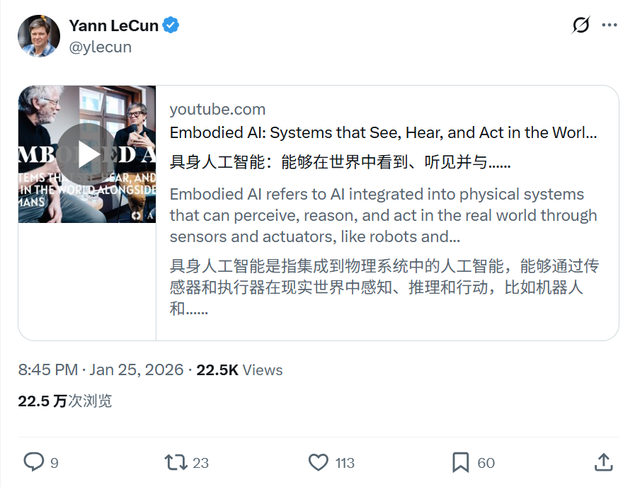
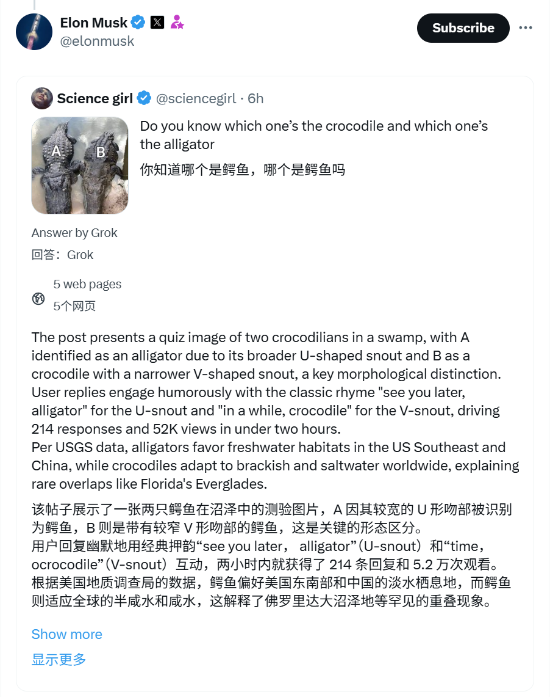

# 2026/01/25 硅谷AI圈动态

**时间范围**: 2026-01-25 00:00 UTC - 2026-01-25 23:59 UTC

---

## 📊 总览

过去24小时，适逢周末，相关账号仅有少量AI相关推文。主要动态集中在 **Yann LeCun** 对具身智能（Embodied AI）未来方向的深度讨论，以及 **Elon Musk** 展示 Grok 的多模态识别与交互能力。本日无重大产品发布或技术突破公告。

| 主题 | 关键事件 |
| :--- | :--- |
| **具身AI与世界模型** | Yann LeCun探讨具身AI挑战及预测性世界模型的重要性 |
| **Grok多模态能力** | Elon Musk展示Grok在视觉识别方面的精准度 |

---

## 🔥 重点帖子详情

#### 1. Meta/Yann LeCun - 具身AI与世界模型探讨
**发布者**: Yann LeCun (@ylecun), 图灵奖得主
**时间**: 2026-01-25 20:45 北京时间
**核心内容**:
- **具身AI挑战**: 分享与 Marc Pollefeys 在 AI House Davos 2026 的炉边对话，深入探讨具身智能 (Embodied AI) 面临的核心难题。
- **关键技术瓶颈**: 这里的挑战包括如何构建高效的**世界模型 (World Models)**、长程**预测规划 (Predictive Planning)** 以及提升**自监督学习 (Self-Supervised Learning)** 在机器人领域的应用效率。
- **VLA模型局限**: 指出当前流行的视觉-语言-动作 (VLA) 模型虽然在多模态上有进展，但存在局限性，并未完全解决物理世界交互的根本问题。
- **未来革命方向**: 再次强调 AI 发展的下一阶段革命将由**预测性世界模型**而非单纯的大语言模型 (LLM) 驱动，机器人硬件效率也是关键一环。

**链接**: 
- [推文](https://x.com/ylecun/status/2015405781252800819)
- [YouTube视频](https://www.youtube.com/watch?v=pJyoqapCRZE)

#### 2. xAI/Elon Musk - Grok多模态能力展示
**发布者**: Elon Musk (@elonmusk)
**时间**: 2026-01-25 20:54:18 (北京时间)
**核心内容**:
- **精准视觉辨识**: 分享 Grok 对用户上传图片的精准分析，成功区分并解释了“鳄鱼 (Crocodile)”与“短吻鳄 (Alligator)”在形态上的细微差异，展示了模型细粒度的视觉理解能力。
- **功能演示**: 通过直接转发 Grok 的生成结果链接，展示其作为 AI 助手在自然生物分类学等垂直领域的知识储备和交互体验。

**链接**: [原帖链接](https://x.com/elonmusk/status/2015407883807084805)

