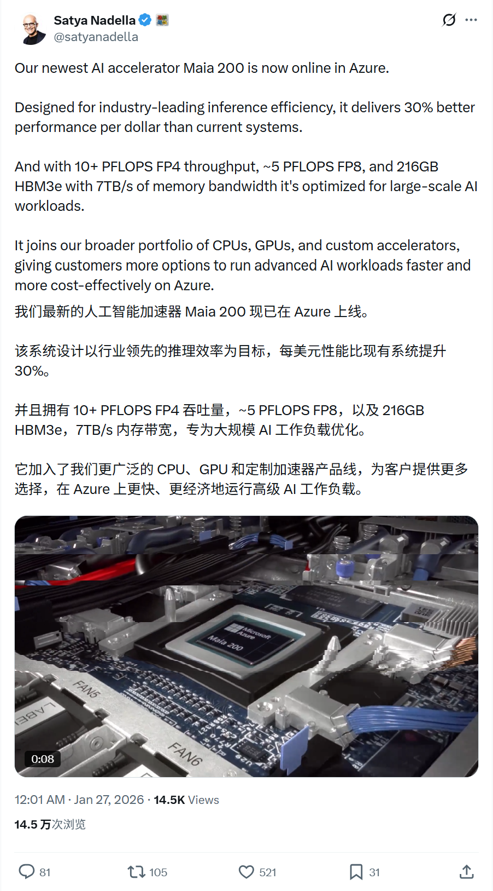
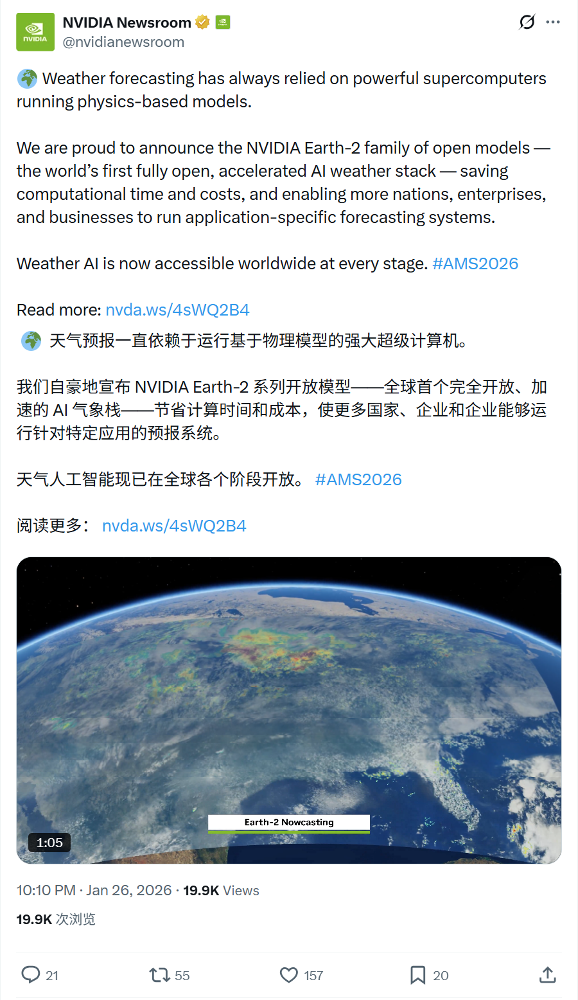
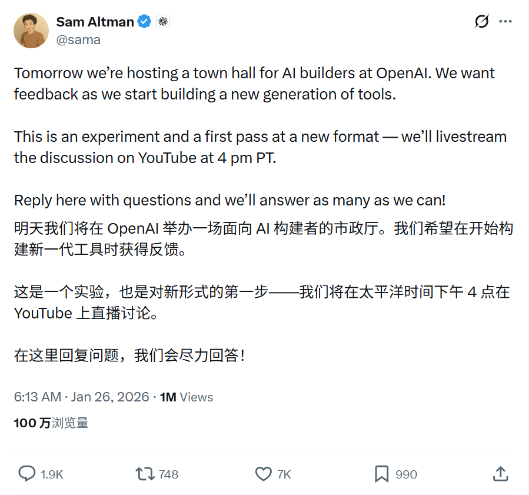
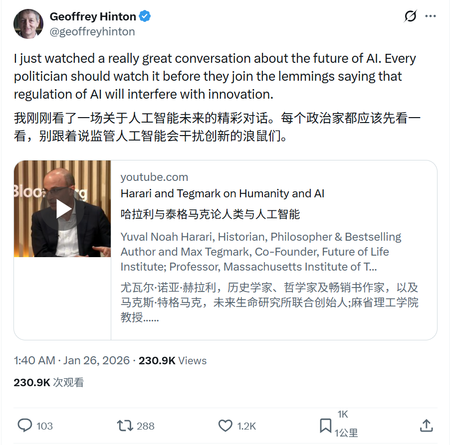
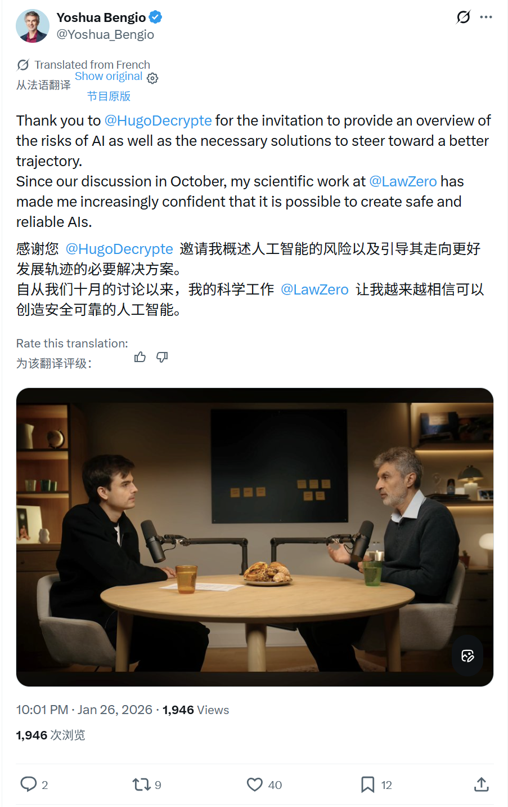

# 2026/01/26 硅谷AI圈动态

**时间范围**: 2026-01-25 17:40 UTC - 2026-01-26 16:01 UTC

---

## 📊 总览

过去24小时，正值周末，硅谷AI圈相对平静。**最重磅的基础设施新闻是Microsoft宣布Maia 200 AI加速器正式上线Azure**。此外，Sam Altman预告了OpenAI即将举办的社区活动，而Geoffrey Hinton和Yoshua Bengio两位图灵奖得主分别就AI监管和安全发表了重要观点。无其他重大AI产品更新。

| 主题 | 关键事件 |
| :--- | :--- |
| **Microsoft** | Maia 200 AI加速器 (芯片) 上线Azure，专为推理优化，提升性价比 |
| **NVIDIA** | Earth-2开放天气AI模型栈 |
| **OpenAI** | Sam Altman宣布举办AI Builders Town Hall，征求社区反馈 |
| **AI观点** | Geoffrey Hinton呼吁政客关注AI监管，避免阻碍创新 |
| **AI安全** | Yoshua Bengio分享访谈，表达对构建可靠AI的信心 |

---

## 🔥 重点帖子详情

#### 1. Microsoft - Maia 200 AI加速器上线
**发布者**: Satya Nadella (@satyanadella)，Microsoft董事长兼CEO
**时间**: 2026-01-26 16:01 UTC
**核心内容**:
- **正式上线**: Maia 200 AI加速器现已在Azure上线，专为AI推理工作负载优化。
- **性能提升**: 提供比前代更好的性价比（提升30%），以及10+ PFLOPS的FP4吞吐量。
- **关于Maia 200**: 它是微软为了不只依赖英伟达，自研的“AI专用算力芯片”，主要用于大规模 AI 模型的训练和推理
- **意义**: 标志着微软在AI芯片领域的自研能力进一步增强，有望降低AI推理成本，提升服务效率。

**链接**: https://x.com/satyanadella/status/2015817413200408959

#### 2. NVIDIA - Earth-2开放天气AI模型栈
**发布者**: NVIDIA (@NVIDIAAI)，官方账号
**时间**: 2026-01-26 15:00 UTC
**核心内容**:
- **首个全开放AI气象栈**: 推出Earth-2系列开放模型，这是全球首个完全开放、加速的AI气象模型栈。
- **通过AI降低成本**: 相比传统基于物理模型的超级计算机预报，Earth-2能显著节省计算时间和成本。
- **普及气象预测能力**: 使更多国家、企业能够运行特定的气象预报系统，实现全球范围内的气象AI普及。

**链接**: https://x.com/huggingface/status/2015801961568760121

#### 3. OpenAI - AI Builders Town Hall预告
**发布者**: Sam Altman (@sama)，OpenAI CEO
**时间**: 2026-01-25 22:13 UTC
**核心内容**:
- **活动预告**: 宣布将于太平洋时间1月26日下午4点（北京时间1月27日早8点）举办“AI Builders Town Hall”。
- **会议议程**: 将在Youtube直播讨论新工具的开发进展。
- **社区互动**: 将积极征求社区的问题和反馈，以改进产品。

**链接**: https://x.com/sama/status/2015548504194654707

#### 4. AI观点 - 呼吁关注AI监管与创新
**发布者**: Geoffrey Hinton (@geoffreyhinton)，图灵奖得主、深度学习之父
**时间**: 2026-01-25 17:40 UTC
**核心内容**:
- **推荐对话**: 推荐了一场关于人工智能未来的深度对话。
- **监管观点**: 呼吁政治家们关注AI监管问题，并警告要避免因“羊群效应”而制定阻碍创新的政策。

**链接**: https://x.com/geoffreyhinton/status/2015479938736890112

#### 5. AI安全 - 构建可靠AI的信心
**发布者**: Yoshua Bengio (@Yoshua_Bengio)，图灵奖得主、Mila创始人
**时间**: 2026-01-26 14:01 UTC
**核心内容**:
- **访谈分享**: 分享了一篇法语访谈内容。
- **风险与安全**: 深入讨论了AI可能带来的风险以及相应的安全解决方案。
- **未来展望**: 表达了对未来构建安全、可靠的人工智能系统越来越有信心。

**链接**: https://x.com/Yoshua_Bengio/status/2015787132938252399

