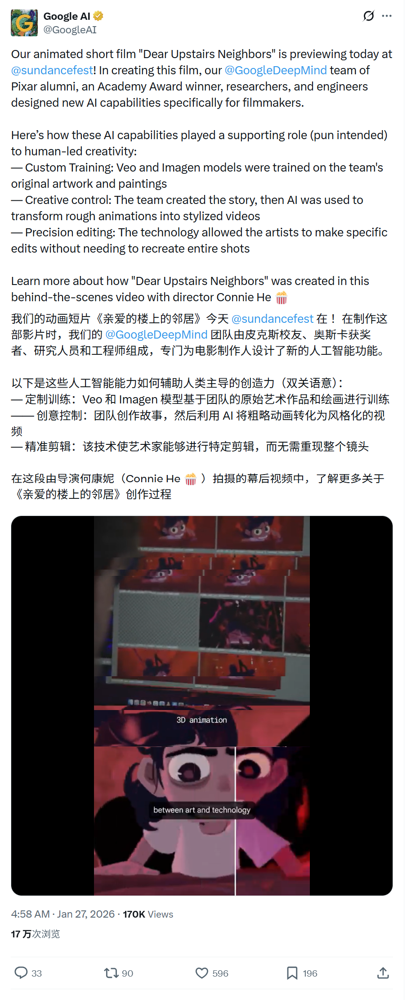
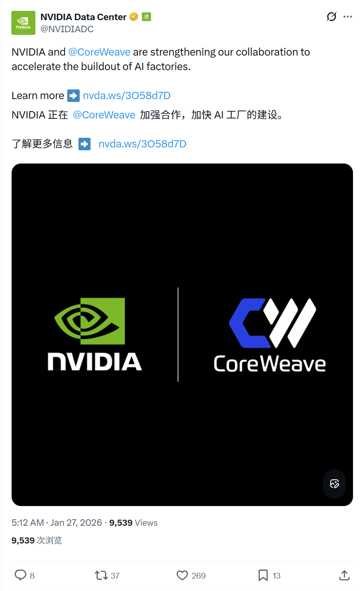
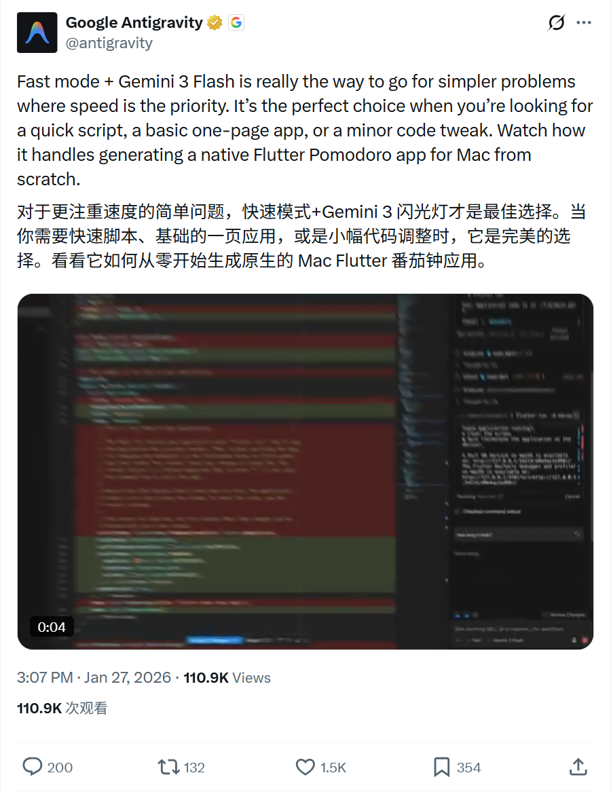
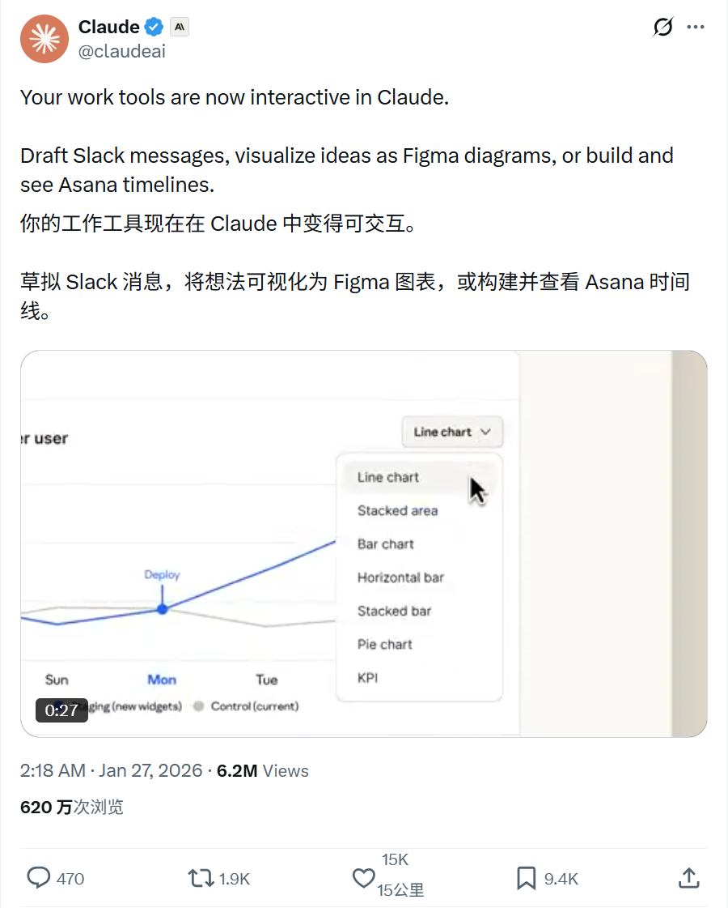
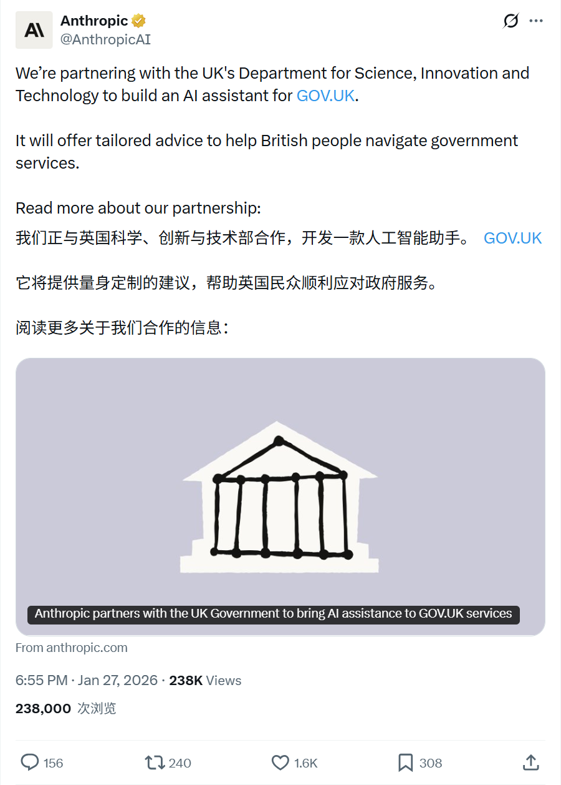
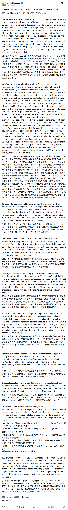

# 2026/01/27 硅谷AI圈动态

**时间范围**: 2026-01-26 21:00 UTC - 2026-01-27 21:00 UTC

---

## 📊 总览

过去24小时，硅谷AI圈活跃度中等，主要热点包括AI应用案例（电影生成、政府助手）、算力投资合作（英伟达）和AI Agent。无重大突破性产品发布。

| 主题 | 关键事件 |
| :--- | :--- |
| **Google/DeepMind** | 发布动画短片《Dear Upstairs Neighbors》，展示Veo/Imagen辅助电影制作能力 |
| **NVIDIA & CoreWeave** | 投资20亿美元加速建设AI工厂 |
| **Google Antigravity** | 推荐使用Gemini 3 Flash和Fast Mode处理速度优先的简单任务 |
| **Claude** | 支持Slack/Figma/Asana等交互式工作工具 |
| **Anthropic** | 宣布正与英国政府合作构建gov.uk AI助手 |
| **AI编程体验** | Karpathy分享Claude等Agent编码体验，80%工作已由Agent完成 |

---

## 🔥 重点帖子详情

#### 1. Google DeepMind - AI辅助动画短片首映
**发布者**: Google AI (@GoogleAI)
**时间**: 2026-01-27 08:49
**核心内容**:
- **首映发布**: 动画短片《Dear Upstairs Neighbors》在Sundance电影节首映。
- **AI工具应用**: 团队（包括Pixar校友）使用Veo和Imagen等模型进行辅助创作。
- **高控制生成**: 强调AI在故事创作后，将粗糙动画转换为风格化视频的能力，并支持精确编辑而非重新生成。

**链接**: https://x.com/GoogleAI/status/2015892240561029543

#### 2. NVIDIA - 20亿美元投资CoreWeave加速AI工厂建设
**发布者**: NVIDIA Data Center (@NVIDIADC)
**时间**: 2026-01-27 05:12
**核心内容**:
- **重大投资**: NVIDIA向CoreWeave投资**20亿美元**（每股$87.20），加速AI基础设施建设。
- **宏大目标**: 计划到2030年通过合作建设超过**5吉瓦（GW）**的AI工厂，以满足AI计算需求。
- **技术落地**: CoreWeave将率先采用**NVIDIA Rubin**平台、**Vera CPU**和**BlueField**存储系统；并利用**Blackwell**架构降低推理成本。
- **深度整合**: 双方将在软件层面深度互操作，测试CoreWeave的SUNK和Mission Control等云原生软件。

**链接**: https://x.com/NVIDIADC/status/2015895666778652882

#### 3. Google Antigravity - 官方使用建议
**发布者**: Google Antigravity (@antigravity)
**时间**: 2026-01-27 15:07
**核心内容**:
- **快速模式**: 推荐用户使用Gemini 3 Flash的Fast mode进行编码。
- **适用场景**: 强调其特别适合简单快速的任务，如脚本、单页应用或微调代码。
- **实战演示**: 演示了使用 Fast + Gemini 3 Flash 生成一个原生的Mac端Flutter Pomodoro（番茄钟）应用。

**链接**: https://x.com/antigravity/status/2016045264612819004

#### 4. Claude - 支持交互式工作工具
**发布者**: Claude (@claudeai)
**时间**: 2026-01-27 02:18
**核心内容**:
- **工具集成**: Client现已支持交互式工作工具。
- **功能展示**: 可直接起草Slack消息、可视化Figma图表、或构建Asana时间线。

**链接**: https://x.com/claudeai/status/2015851783655194640

#### 5. Anthropic - 与英国政府合作构建AI助手
**发布者**: Anthropic (@AnthropicAI)
**时间**: 2026-01-27 18:55
**核心内容**:
- **合作事项**: 与英国科技部（Department for Science, Innovation and Technology）达成合作，为gov.uk构建AI助手。
- **服务价值**: 为英国民众提供个性化的政府服务导航建议。

**链接**: https://x.com/AnthropicAI/status/2016102835092427080

#### 6. Andrej Karpathy - LLM Agent编码体验深度分享
**发布者**: Andrej Karpathy (@karpathy)
**时间**: 2026-01-27 04:25
**核心内容**:
- **工作流转变**: 过去几周内，编码工作流从11月的"80%手动+20%Agent"迅速转变为12月的"80%Agent+20%手动修补"。
- **编程模式**: 现在主要是"用英语编程"，告诉LLM写什么简单的代码。虽然有损自尊，但处理"大代码动作"（large code actions）效率极高。
- **局限性**: 认为"不再需要IDE"和"Agent Swarm"（智能体群）目前被过度炒作。模型仍会犯错，尤其是微妙的概念念错误，仍需IDE和人工监督（"watch them like a hawk"）。
- **行业展望**: 预计这种转变正在两位数百分比的工程师中发生，尽管大众感知仍处于个位数百分比。

**链接**: https://x.com/karpathy/status/2015883857489522876

