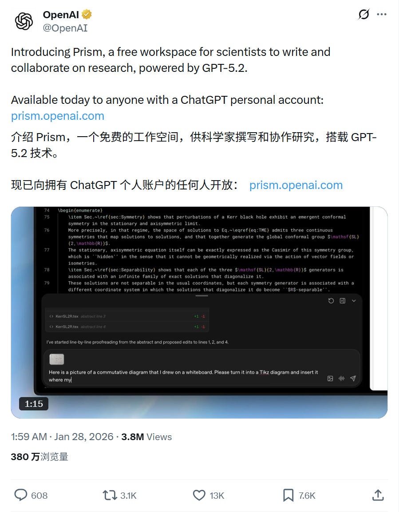
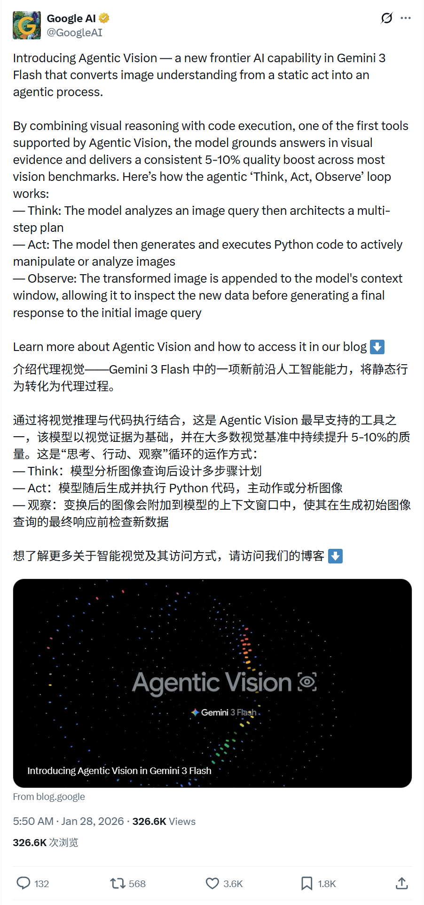
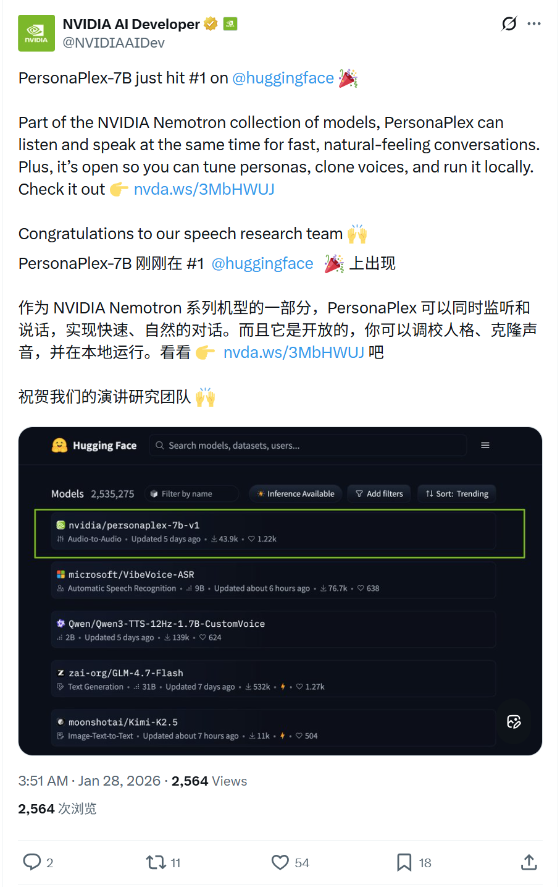
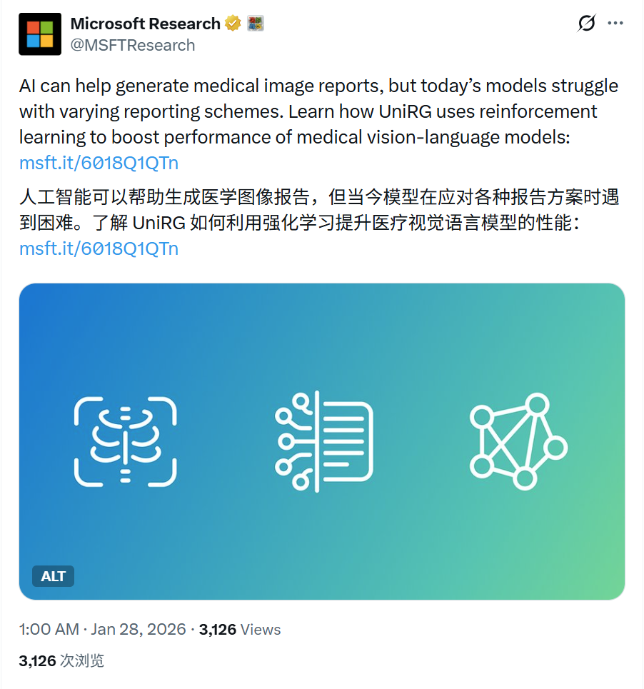

# 2026/01/28 硅谷AI圈动态

**时间范围**: 2026-01-27 17:00 UTC - 2026-01-28 05:00 UTC

---

## 📊 总览

过去24小时，硅谷AI圈活跃度较高，围绕多模态/Agent能力提升、科研论文工具、开源语音模型和AI医疗研究。无明显治理或法律争议事件。

| 主题 | 关键事件 |
| :--- | :--- |
| **OpenAI** | 发布 Prism：AI 驱动的科学文档编辑器，集成 GPT-5.2 |
| **Google Gemini** | 介绍 Gemini 3 Flash "Agentic Vision" (主动视觉) 能力 |
| **NVIDIA 语音** | Personaplex-7B 模型登顶 Hugging Face 趋势榜首 (#1) |
| **微软医疗 AI** | 发布 UniRG 框架，革新医学影像报告生成 |
| **xAI Grok** | Grok 可生成10秒视频，音频质量亦提升 |

---

## 🔥 重点帖子详情

#### 1. OpenAI - [发布Prism: AI 驱动的 LaTeX 科学文档编辑器]
**发布者**: OpenAI (@OpenAI)
**时间**: 2026-01-27 17:59 UTC
**核心内容**:
- **[Prism 发布]**: 推出 "Prism"，一款由 AI 驱动的 LaTeX 编辑器，专为撰写科学文档设计。它不仅支持实时协作，还内置了 OpenAI 的智能功能，辅助草稿撰写、思路梳理及排版。
- **[内置 GPT-5.2]**: 直接集成 GPT-5.2，用户可用自然语言指令完成复杂任务，如根据论文其余内容撰写摘要、添加参考文献并推荐遗漏的相关工作、将手绘草图转换为 LaTeX 代码、生成 4x4 表格等。
- **[智能与协作]**: 提供逻辑检查（找出错误或逻辑缺口）、内容优化（生成 Beamer 演示文稿、翻译摘要）以及实时协作功能（Share 菜单邀请协作者，实时查看更新和注释）。

**链接**: https://x.com/OpenAI/status/2016209462621831448

#### 2. Google AI - Gemini 3 Flash 引入 Agentic Vision
**发布者**: Google AI (@GoogleAI)
**时间**: 2026-01-27 21:50 UTC
**核心内容**:
- **[主动视觉能力]**: 推出 "Agentic Vision" (Agentic Vision capability)，使 Gemini 3 Flash 不再只是静态地“看”图，而是能像智能体（Agent）一样主动探究。
- **[思考-行动-观察环]**: 引入 "Think, Act, Observe" 循环。模型能利用视觉推理制定计划（Think），编写并执行 Python 代码来缩放、裁剪或测量图片（Act），然后将处理后的新视图反馈回上下文（Observe）。
- **[精准度提升]**: 这种“主动调查”的方式，配合代码执行能力，大幅提升了模型在细粒度视觉任务（如数数、测量物体、查看微小细节）上的准确性。

**链接**: 
- https://x.com/GoogleAI/status/2016267526330601720
- https://blog.google/innovation-and-ai/technology/developers-tools/agentic-vision-gemini-3-flash/

#### 3. NVIDIA AI - Personaplex-7B 登顶 HF 榜首
**发布者**: NVIDIA AI Developer (@NVIDIAAIDev)
**时间**: 2026-01-27 19:51 UTC
**核心内容**:
- **[热度登顶]**: Personaplex-7B-v1 刚刚荣登 Hugging Face 趋势榜第一名 (#1 Trending on Hugging Face)
- **[模型介绍]**: 这是一个 7B 参数的实时语音-语音（Speech-to-Speech）对话模型，支持全双工交互。
- **[自然对话流]**: 该模型支持模拟真实的人类对话动态，包括打断（interruptions）、插话（barge-ins）、重叠说话和快速轮转，打破了传统语音助手“你问我答”的僵硬模式。
- **[双流架构]**: 采用监听和说话并发的双流设计，基于 Moshi 架构及 NVIDIA 的硬件优化，实现了极低延迟的实时交互。

**链接**: 
- https://x.com/NVIDIAAIDev/status/2016237681852719241
- https://huggingface.co/nvidia/personaplex-7b-v1?linkId=100000404678650

#### 4. Microsoft Research - UniRG 医疗影像报告生成
**发布者**: Microsoft Research (@MSFTResearch)
**时间**: 2026-01-27 17:00 UTC
**核心内容**:
- **[通用报告生成]**: 发布 UniRG (Universal Report Generation) 框架，旨在利用多模态强化学习（RL）解决医疗影像报告生成的扩展性问题。
- **[临床对齐]**: 传统模型常因不同医院报告风格差异而过拟合，UniRG 通过强化学习直接优化临床相关的奖励信号（clinically grounded reward signals），而非仅模仿文本，从而生成更准确、通用的临床报告。
- **[SOTA 性能]**: 模型 UniRG-CXR 在包含 56 万份研究、78 万张图像的大规模数据集上训练，在 ReXrank 榜单上达成新的 State-of-the-Art，展现了极强的跨机构泛化能力。

**链接**: 
- https://x.com/MSFTResearch/status/2016194490571051113
- https://www.microsoft.com/en-us/research/blog/unirg-scaling-medical-imaging-report-generation-with-multimodal-reinforcement-learning/

#### 5. Elon Musk - Grok 音视频能力更新
**发布者**: Elon Musk (@elonmusk)
**时间**: 2026-01-27 23:51 UTC (北京时间 1月28日 07:51)
**核心内容**:
- **[视频时长提升]**: Grok 视频生成长度现已提升至 **10秒**，标志着其在连贯视频生成能力上的显著进步。
- **[音频质量大幅提升]**: 伴随视频时长的增加，音频生成的质量也得到了“大幅提升”（greatly improved），为用户带来更佳的视听体验。

**链接**: https://x.com/elonmusk/status/2016539664782422428

