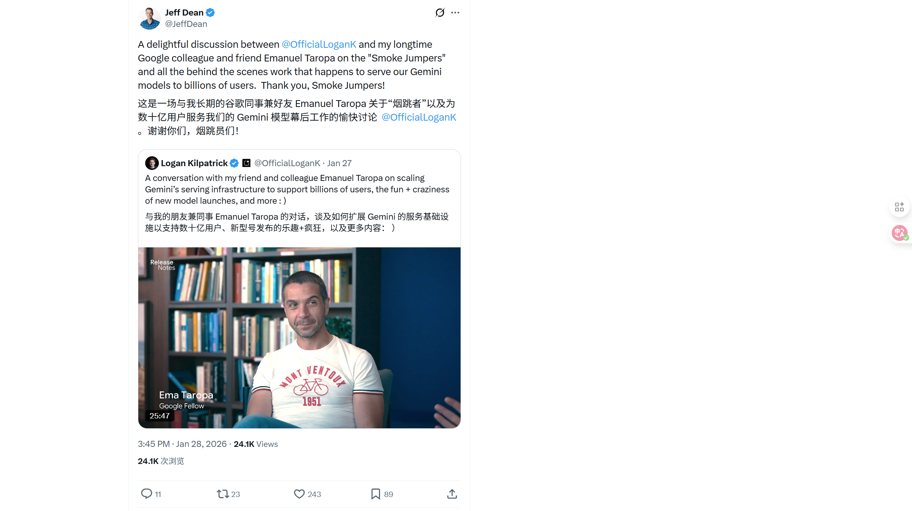

# 2026/01/29 硅谷AI圈动态

**时间范围**: 2026-01-28 07:45 UTC - 2026-01-28 15:52 UTC

---

## 📊 总览

过去24小时，硅谷AI相关推文集中于AI产品进展（Grok）、企业AI应用（Mistral）和硬件前沿（NVIDIA量子加速）。无其他重大新模型发布或突破性事件。

| 主题 | 关键事件 |
| :--- | :--- |

| **Grok** | **视频生成能力增强**，时长延至10秒且音频质量大幅提升 |
| **Mistral AI** | **企业级部署落地**，与全球企业合作应用前沿AI于光刻及物流等领域 |
| **NVIDIA Quantum** | **发布量子计算加速方案**，NVQLink和CUDA-Q实现量子-经典混合计算微秒级低延迟 |
| **Google Gemini** | **揭秘"Smoke Jumpers"团队**，展示支撑数十亿用户规模的基础设施幕后工作 |

---

## 🔥 重点帖子详情

#### 1. xAI - Grok视频音频增强
**发布者**: Elon Musk (@elonmusk)
**时间**: 2026-01-28 15:51 UTC
**核心内容**:
- **视频时长延长**: Grok生成的视频长度限制现在提升至**10秒**。
- **音频质量飞跃**: 配套生成的音频质量得到了**大幅提升**。
- **多模态进展**: 展示了持续迭代的多模态生成能力。

**链接**: https://x.com/elonmusk/status/2016539664782422428

#### 2. Mistral AI - 前沿AI企业落地
**发布者**: Mistral AI (@MistralAI)
**时间**: 2026-01-28 15:32 UTC
**核心内容**:
- **构建前沿系统**: 宣布正在与全球标志性公司合作，构建并部署前沿AI系统。
- **实际生产用例**: 
    - **硅光刻加速**: 优化芯片制造中的光刻流程。
    - **海运物流优化**: 简化全球海运物流网络。
- **解决全球挑战**: 致力于利用AI应对世界上最严峻的挑战。

**链接**: https://x.com/MistralAI/status/2016534920978477524

#### 3. NVIDIA - 量子加速超级计算机
**发布者**: NVIDIA Data Center (@NVIDIADC)
**时间**: 2026-01-28 14:00 UTC
**核心内容**:
- **量子加速器集成**: 未来超级计算机将集成量子加速器以解决极端挑战。
- **紧密耦合设计**: 这种集成需要紧密的耦合和极端的协同设计（Co-design）。
- **技术突破**: 
    - **NVIDIA NVQLink**: 实现GPU与量子处理器的连接。
    - **CUDA-Q**: 支持混合编程模型。
- **微秒级延迟**: 实现**微秒级**延迟，支持实时纠错和真正的量子-经典混合工作流。

**链接**: https://x.com/NVIDIADC/status/2016511580914028987

#### 4. Google - Gemini基础设施团队揭秘
**发布者**: Jeff Dean (@JeffDean)
**时间**: 2026-01-28 07:45 UTC
**核心内容**:
- **幕后英雄**: 分享了Logan Kilpatrick与Emanuel Taropa（Google长期同事）的对话。
- **Smoke Jumpers团队**: 介绍了被称为"Smoke Jumpers"的模型服务基础设施团队。
- **数十亿用户规模**: 展示了该团队为支撑Gemini模型服务**数十亿用户**所做的幕后工作和扩展挑战。

**链接**: https://x.com/JeffDean/status/2016417342444769523

