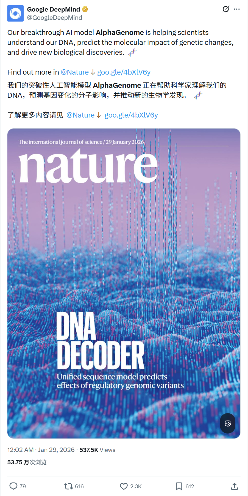
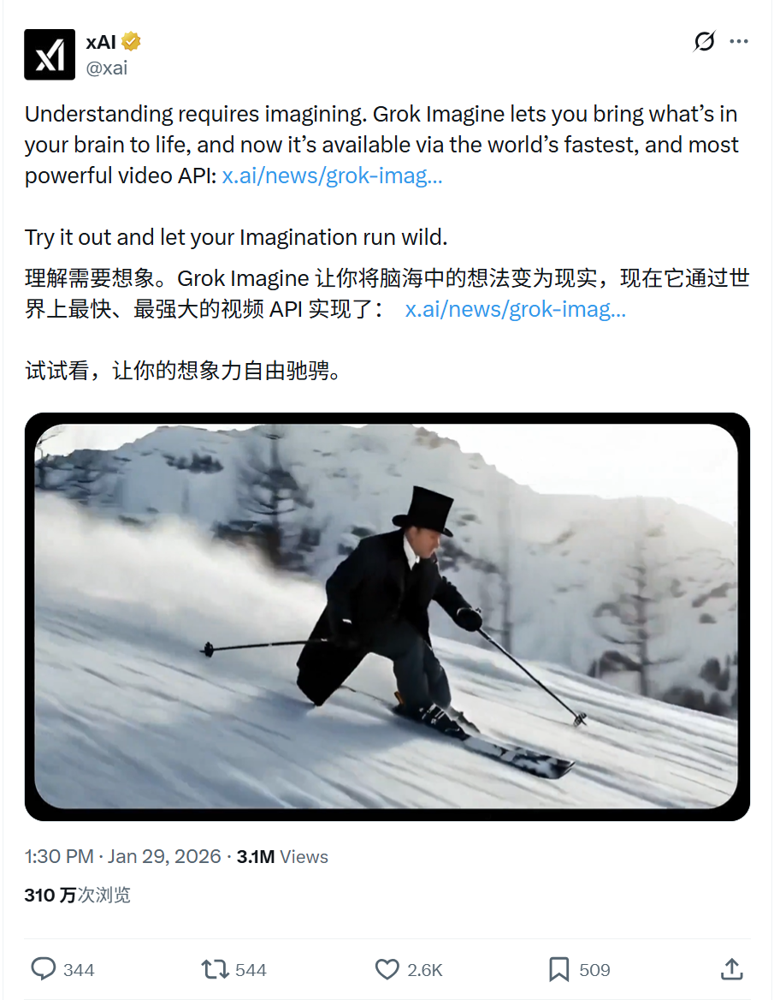
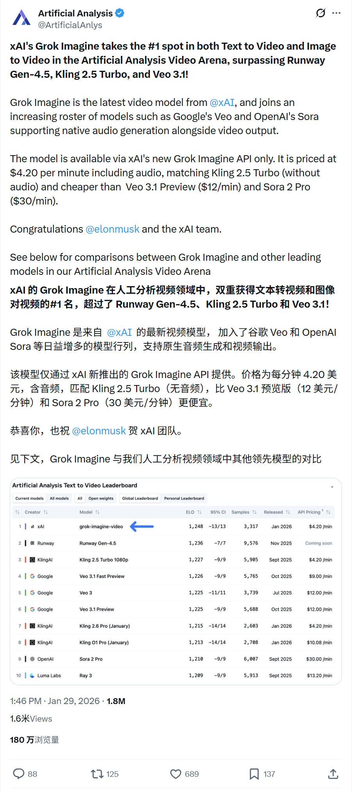
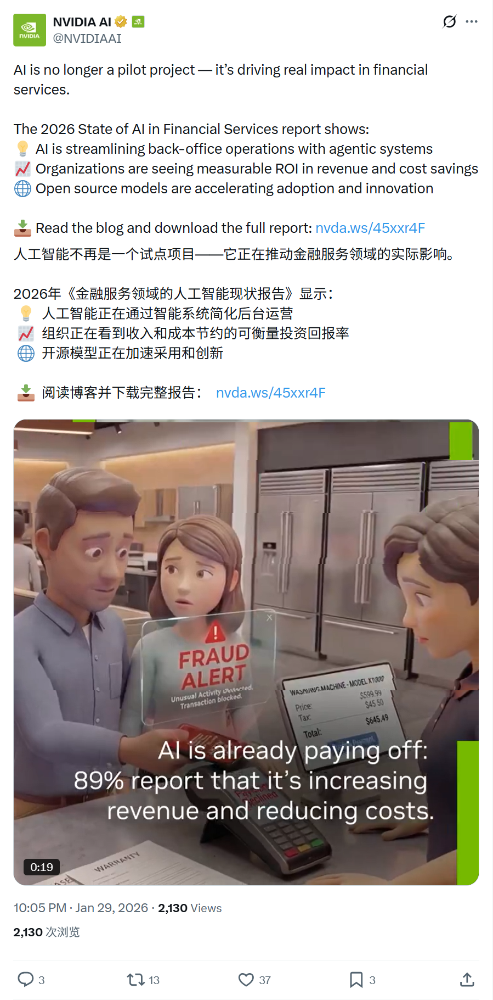

# 2026/01/29 硅谷AI圈动态

**时间范围**: 2026-01-29 05:30 UTC - 2026-01-29 14:05 UTC

---

## 📊 总览

过去24小时，硅谷AI圈活跃度一般。最活跃的是马斯克和xAI，围绕Grok Imagine API发布了10多条推文。而Google在Nature正式发布AlphaGenome模型，助力人类DNA和生物学研究。

| 主题 | 关键事件 |
| :--- | :--- |
| **Google DeepMind** | 发布AlphaGenome基因组模型，登上Nature封面 |
| **xAI** | Grok Imagine API上线，斩获视频生成模型双料冠军 |
| **NVIDIA** | 2026金融业调查：AI助力增收减本，从试点转向实战 |

---

## 🔥 重点帖子详情

#### 1. Google DeepMind - AlphaGenome：解密DNA的AI新突破
**发布者**: Google DeepMind / Demis Hassabis (@demishassabis)
**时间**: 2026-01-29 06:42 UTC
**核心内容**:
- **Nature封面重磅发布**: DeepMind发布了最新的基因组学模型AlphaGenome，相关论文发表在《Nature》杂志上。
- **卓越性能**: AlphaGenome在26项变异效应预测评估中，有25项匹配或超过了目前最强的外部模型。
- **全基因组理解**: 这是一个统一的DNA序列模型，能输入1Mb的长序列，以单碱基分辨率预测数千种功能基因组轨迹。
- **开源贡献**: 模型权重已向学术研究人员开放，旨在帮助科学家理解DNA、预测基因变化的分子影响并推动生物学新发现。

**链接**:
- [Demis Hassabis推文](https://x.com/demishassabis/status/2016763919646478403)
- [Google DeepMind主贴](https://x.com/GoogleDeepMind/status/2016542480955535475)
- [Nature原文](https://www.nature.com/articles/s41586-025-10014-0)

#### 2. xAI - Grok Imagine API：视频生成新霸主
**发布者**: xAI (@xai) / Artificial Analysis
**时间**: 2026-01-29 05:30 UTC
**核心内容**:
- **API正式上线**: xAI推出了Grok Imagine API，这是一套统一的创意工作流API，提供最先进的视频生成和突破性的视频编辑功能。
- **评测登顶**: 在Artificial Analysis的视频Arena中，Grok Imagine拿下“文本生成视频”和“图像生成视频”双料第一，超越了Runway Gen-4.5, Kling 2.5 Turbo和Google Veo 3.1。
- **高级编辑功能**: 支持通过文本指令添加、移除或替换视频中的对象。
- **极致性价比**: 定价极具竞争力，每分钟视频生成仅需$4.20（含音频），远低于Sora 2 Pro ($30/min) 和 Veo 3.1 ($12/min)。

**链接**:
- [xAI推文](https://x.com/xai/status/2016745652739363129)
- [Grok Imagine API页面](https://x.ai/news/grok-imagine-api)
- [Artificial Analysis评测](https://x.com/ArtificialAnlys/status/2016749756081721561)

#### 3. NVIDIA - 2026金融服务AI调查：AI不再只是试点
**发布者**: NVIDIA AI (@NVIDIAAI)
**时间**: 2026-01-29 14:05 UTC
**核心内容**:
- **实战转型**: 调查显示，AI在金融服务业已不再是试点项目，正在推动实质性的业务影响。
- **显著收益**: 89%的受访者表示AI帮助增加了年度收入并降低了成本；近100%的机构计划在未来一年增加或保持AI预算。
- **Agentic AI崛起**: 42%的金融机构正在使用或评估“代理式AI”(Agentic AI)，其中21%已经部署了相关应用。
- **开源与创新**: 开源模型正成为加速采用和创新的关键部分，84%的机构将其视为战略重点。

**链接**:
- [NVIDIA AI推文](https://x.com/NVIDIAAI/status/2016875227897045250)
- [完整调查报告](https://blogs.nvidia.com/blog/ai-in-financial-services-survey-2026/)

